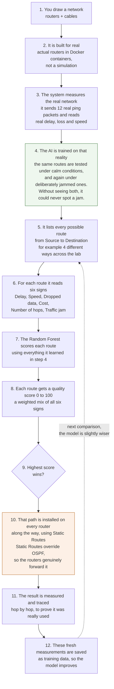

# How the AI Chooses a Better Route

The plain-language version of diagram 9 and diagram 13 in
[`ALGORITHM_FLOWCHARTS.md`](./ALGORITHM_FLOWCHARTS.md), written for a reader who
does not work with networks. The technical terms are kept where they are useful.

## Why this makes routing better

OSPF always picks the **shortest** path — fewest hops, lowest cost. The AI picks the
**fastest and least jammed** path.

Those are often different routes. The gap only opens when traffic is heavy or a link
is faulty, which is exactly when a fixed rule has no way to react. Think of it as the
difference between following the shortest road on a map and asking someone who has
just driven the traffic.

## The three things that make it honest

**It works on measurements, not guesses.** Every number in the chain comes from a
command run inside a real router. The Random Forest contributes exactly one input —
how jammed a route is — and never invents a latency or a speed.

**It is installed on every router, not just the first one.** Pushing the route onto
the source router alone does not work: the second router then makes its own choice
for the rest of the journey. Every hop is pinned.

**It refuses to claim an improvement that is not there.** The AI can only change the
route when there is a genuine choice. On a simple network the two paths are often
identical, and the page says so rather than inventing a win. For the same reason, a
latency difference smaller than the measurement's own wobble is reported as a tie,
not as a percentage.

## Vocabulary

| Term | Plain meaning |
|------|---------------|
| **Router** | A machine that decides which path traffic takes |
| **OSPF** | The standard rule every network uses: always take the shortest path |
| **Random Forest** | A learner that averages many simple decisions into one judgement |
| **Static Route** | A route typed in by hand, which beats what OSPF would choose |
| **Latency** | How long data takes to arrive |
| **Bandwidth** | How much data can flow at once |
| **Packet loss** | Data that never arrived |
| **Congestion** | A queue of traffic backed up, like cars at a jam |
| **Hop** | One step from one router to the next |