# NetRouteAI — Complete Algorithm Flowcharts

Every diagram below is transcribed from the running code, not from intention. Each
section names the file and function it documents so a reader can diff the diagram
against the source.

**Rendered with Mermaid** — GitHub, GitLab, VS Code (Markdown Preview Mermaid
Support) and Obsidian all render these natively.

---

## Table of contents

| # | Algorithm | Source |
|---|-----------|--------|
| 1 | [System overview](#1-system-overview) | whole project |
| 2 | [Automatic address planning (canvas trigger)](#2-automatic-address-planning-canvas-trigger) | `frontend/src/App.tsx` |
| 3 | [`resolve_plan` — the addressing algorithm](#3-resolve_plan--the-addressing-algorithm) | `backend/lab_deploy.py` |
| 4 | [`_addresses_for` — one link's address](#4-_addresses_for--one-links-address) | `backend/lab_deploy.py` |
| 5 | [`deploy` — build, start, configure, prove](#5-deploy--build-start-configure-prove) | `backend/lab_deploy.py` |
| 6 | [`configure` — vtysh plus read-back](#6-configure--vtysh-plus-read-back) | `backend/lab_deploy.py` |
| 7 | [OSPF path resolution — three sources](#7-ospf-path-resolution--three-sources) | `backend/ospf_ai_service.py` |
| 8 | [`_rib_walk` — walking the OSPF RIB](#8-_rib_walk--walking-the-ospf-rib) | `backend/ospf_ai_service.py` |
| 9 | [`rank_paths` — AI path scoring](#9-rank_paths--ai-path-scoring) | `backend/ai_route_service.py` |
| 10 | [`compare_ospf_vs_ai` — the Analytics run](#10-compare_ospf_vs_ai--the-analytics-run) | `backend/ospf_ai_service.py` |
| 11 | [`_measure_path_hops` — the noise floor](#11-_measure_path_hops--the-noise-floor) | `backend/ospf_ai_service.py` |
| 12 | [Latency verdict — is the gap real?](#12-latency-verdict--is-the-gap-real) | `backend/ospf_ai_service.py` |
| 13 | [Steering the data plane](#13-steering-the-data-plane) | `backend/route_steer.py` |
| 14 | [`apply_impairment` — tc chaining](#14-apply_impairment--tc-chaining) | `backend/metrics_collector.py` |
| 15 | [`measure_bandwidth` — real throughput](#15-measure_bandwidth--real-throughput) | `backend/metrics_collector.py` |
| 16 | [`measure_convergence` — timed failure](#16-measure_convergence--timed-failure) | `backend/convergence.py` |
| 17 | [OSPF area change](#17-ospf-area-change) | `backend/ospf_area.py` |
| 18 | [Dataset collection loop](#18-dataset-collection-loop) | `backend/dataset_collector.py` |
| 19 | [Theme + contrast audit](#19-theme--contrast-audit) | `frontend/src/utils/theme.ts`, `scripts/audit_contrast.py` |
| 20 | [Endpoint → algorithm map](#20-endpoint--algorithm-map) | `backend/main.py` |

---

## The five invariants every diagram enforces

These are the properties the whole design exists to hold. Each is a rejection
path somewhere in the diagrams below.

| # | Invariant | Enforced by |
|---|-----------|-------------|
| I1 | **An IP on the canvas is the IP the routers get.** Not a re-derivation that could disagree. | `resolve_plan` runs once per plan; `adoptPlan` writes *its* output back onto the canvas. Diagram 2, 3 |
| I2 | **Every displayed number is measured.** No constants, no placeholders. | Every measurement diagram returns `None`/`n/a` rather than a guess. Diagrams 7–18 |
| I3 | **A supplied address always beats the address class.** | `_addresses_for` checks the supplied branch *first*. Diagram 4 |
| I4 | **Deleting a link or router releases its address.** | The allocator is stateless — a subnet is taken only by the topology being planned, and each class rescans from the start. Diagram 3 |
| I5 | **The label never exceeds the evidence.** | Noise-floor gate before declaring a winner; `"n/a"` otherwise. Diagram 12 |

---

## 1. System overview

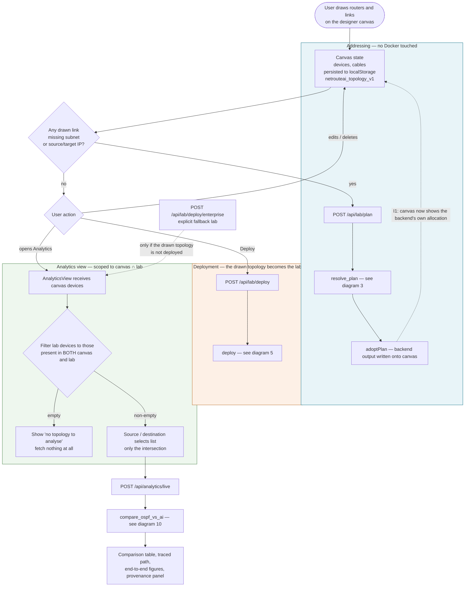

**Reading it:** the designer is the source of truth for *shape*; the backend is the
source of truth for *addresses*. Planning is deliberately separated from deploying
so an IP can appear on the canvas long before any container exists — and it is the
*same* allocator that later configures the routers, which is what makes I1 true
rather than merely likely.

---

## 2. Automatic address planning (canvas trigger)

`frontend/src/App.tsx` — `unaddressedKey`, `plannedKeyRef`, `useEffect`

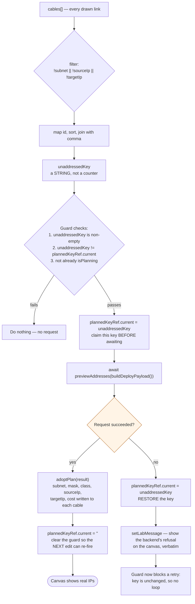

**Why the key is remembered, not just an `isPlanning` flag:** a `useEffect` that
fires on `[unaddressedKey]` re-runs whenever the component re-renders with the same
inputs. Guarding on `isPlanning` alone means a backend *refusal* — "no free Class C
subnet" — re-fires on every render, forever. Remembering the key that was asked
about makes a refusal terminal until the user actually changes something.

`adoptPlan` also **strips** addresses from cables absent from the plan, so a link
whose address was released stops the canvas claiming to hold it (I4).

---

## 3. `resolve_plan` — the addressing algorithm

`backend/lab_deploy.py:146`. This is the single allocator. It backs both
`POST /api/lab/plan` and `POST /api/lab/deploy`.

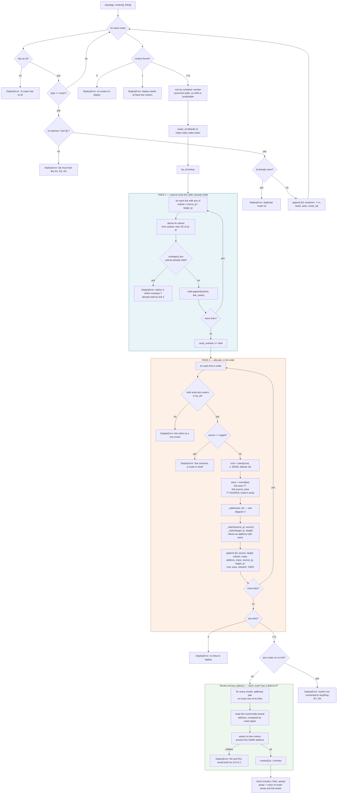

### Pass 1 exists because allocation is greedy

Without it, a link needing a *fresh* subnet takes the first free candidate **even
when a link further down the list already sits on it** — then that later link is
refused as a duplicate and the whole plan fails while a free subnet sits unused.

Reproduced on the running 14-link lab by renumbering `l6` (which comes before
`l7`) to Class A:

```
greedy, single pass:   l6 claims 10.0.0.0/8  →  l7 refused  →  HTTP 400
two-pass reservation:  l6 gets 11.0.0.0/8    →  l7 keeps 10.0.0.0/8  →  HTTP 200
```

### Why `overlaps()` and not equality

Equality is not sufficient. `10.0.0.0/24` is not *equal* to `10.0.0.0/8`, but every
address in the `/24` is also inside the `/8` — so a Class A link could be handed the
containing `/8` while another link held the `/24`, and the routers would be
configured with **the same host addresses on two different links**. The per-class
blocks are disjoint by first octet, so this can only arise across a prefix
boundary, but it has to be caught.

Sibling `/24`s inside one `/8` (`10.0.0.0/24` and `10.5.0.0/24`) still allocate
normally, because they genuinely do not overlap.

### I4 — deletion is free

There is no pool and nothing to release. A subnet is "taken" only by the topology
currently being planned, and each class rescans its candidates from the start. So
deleting `l5` hands `192.168.3.0/24` straight back to the next link that needs one,
and drawing the link again returns it.

---

## 4. `_addresses_for` — one link's address

`backend/lab_deploy.py:382`

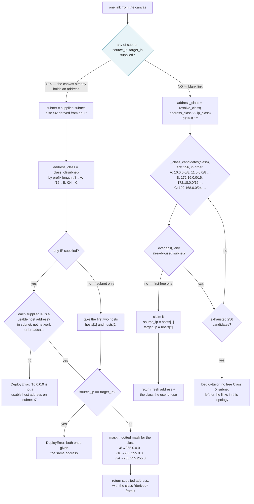

### The class pools are disjoint

| Class | Mask | Drawn from | Never collides with |
|-------|------|-----------|---------------------|
| A | `/8` — `255.0.0.0` | `10.0.0.0/8`, `11.0.0.0/8`, … `99.0.0.0/8` | B or C |
| B | `/16` — `255.255.0.0` | `172.16.0.0/16`, `172.18.0.0/16` … `172.31.0.0/16` | A or C |
| C | `/24` — `255.255.255.0` | `192.168.0.0/24` … `192.168.255.0/24` | A or B |

A Class A link can therefore never be handed the same subnet as a Class C one,
whatever order the links arrive in. `172.17.0.0/16` is deliberately absent from the
B pool because it is Docker's default bridge range.

### I3 — supplied address beats class

The `SUP` branch is checked **first** and returns immediately. This is the whole
guarantee in I1: an address already on the canvas survives planning untouched, and
because the lab is configured from the plan, the routers get it.

The corollary, which was a real defect until fixed: **changing the class on an
already-addressed link did nothing at all.** The held subnet was honoured and the
chosen class silently discarded, with the backend reporting the old class back.
The fix is in the UI, not the allocator — `CablePropertiesPanel` now clears
`subnet`/`subnetMask`/`sourceIp`/`targetIp` alongside the class, which puts the
link back into the unaddressed set of diagram 2 so it is genuinely renumbered.

---

## 5. `deploy` — build, start, configure, prove

`backend/lab_deploy.py:1002`

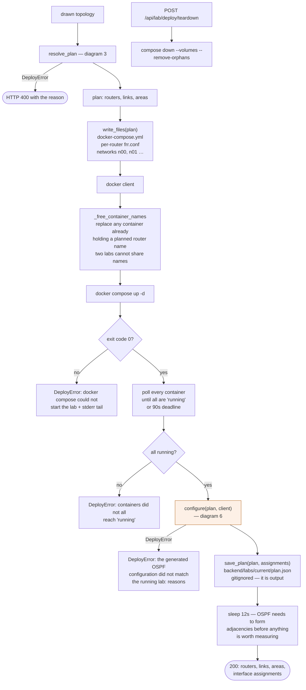

**Deploy never restarts the lab.** The containers are created with a minimal
`frr.conf` and the real configuration is pushed into the *running* `vtysh`.
Interface names (`eth0..ethN`) are not stable across a Docker restart — they are
handed out in a different order — so a config generated from a pre-restart reading
lands each area and cost on the **wrong interface**, and FRR accepts it without
complaint. The lab then looks healthy while OSPF silently runs on the wrong links.
Chasing the mapping across restarts does not converge; never restarting does.

---

## 6. `configure` — vtysh plus read-back

`backend/lab_deploy.py:743`

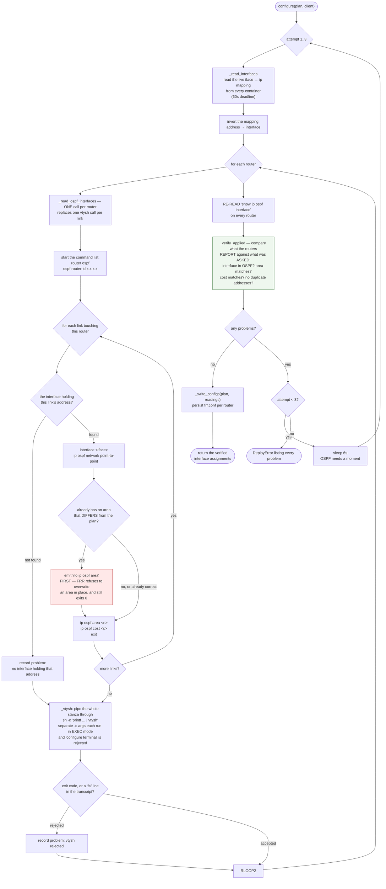

### Why verification is a read-back and not an exit status

`vtysh` exits **0** while rejecting lines. Two specific cases:

- `ip ospf area <n>` answers `Must remove previous area config before changing ospf area` and still exits 0.
- Any unknown command likewise exits 0.

So an exit code cannot distinguish "applied" from "silently refused". The only
honest check is to ask the router what it actually has, which is
`show ip ospf interface` — an interface only appears there once OSPF is
operational, so a configured-but-down interface is correctly reported as *absent*
rather than as being in area 0.

Area state read this way also means **ABR status is derived** from a router actually
holding interfaces in more than one area, rather than asserted.

---

## 7. OSPF path resolution — two live sources, or a raised refusal

`backend/ospf_ai_service.py:672` (`compare_ospf_vs_ai`). Which path is "the OSPF
path" is the single most consequential decision on the Analytics page.

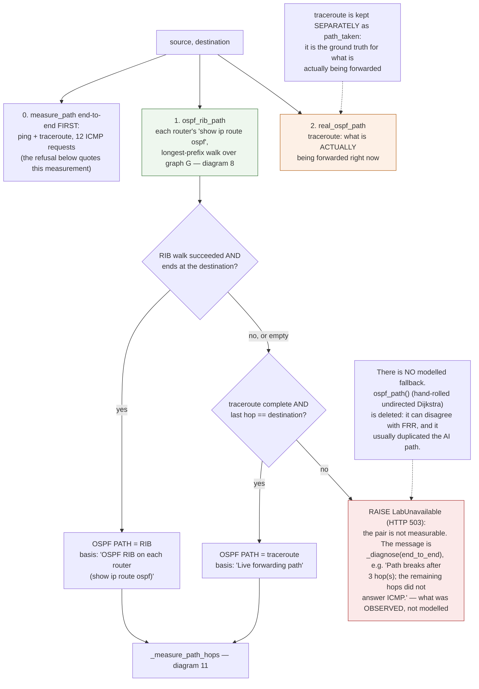

### Why the RIB is authoritative and traceroute is not

Reading "the OSPF path" from traceroute is **circular once the lab is steered**: a
static route makes traceroute report the AI path back, and calling that "the OSPF
path" means the page compares the AI path against itself and always declares a
match. The RIB is unaffected by injected static routes, so it is what OSPF itself
would forward.

A hand-rolled SPF is unreliable in general and is **deleted here entirely**, not
kept as a labelled last resort. **OSPF charges cost on each router's own outgoing
interface** — RFC 2328 §2.1.2 states that "a cost is associated with the output
side of each router interface" and models the result as a *directed* graph — so an
interface can cost 5 outbound and 20 on the return direction, which a symmetric
undirected graph cannot express. In *this* lab that particular trap is not armed
(`ip ospf cost {link cost}` is applied to both ends), but the modelled path had two
failings that did apply: the RIB remains the authority on what OSPF would forward,
and the modelled path usually duplicated the AI path, making it an unhelpful third
answer. So when the RIB walk fails *and* the traceroute does not reach the
destination, the comparison raises — with the measured end-to-end probe's observed
reason — instead of inventing a route the routers were never asked about.

### `lab_graph` — the routable graph

Built once per comparison and reused by every algorithm below. It is **live-state
aware**: an interface that is administratively down, or shaped by `tc`, changes
what the graph may claim.

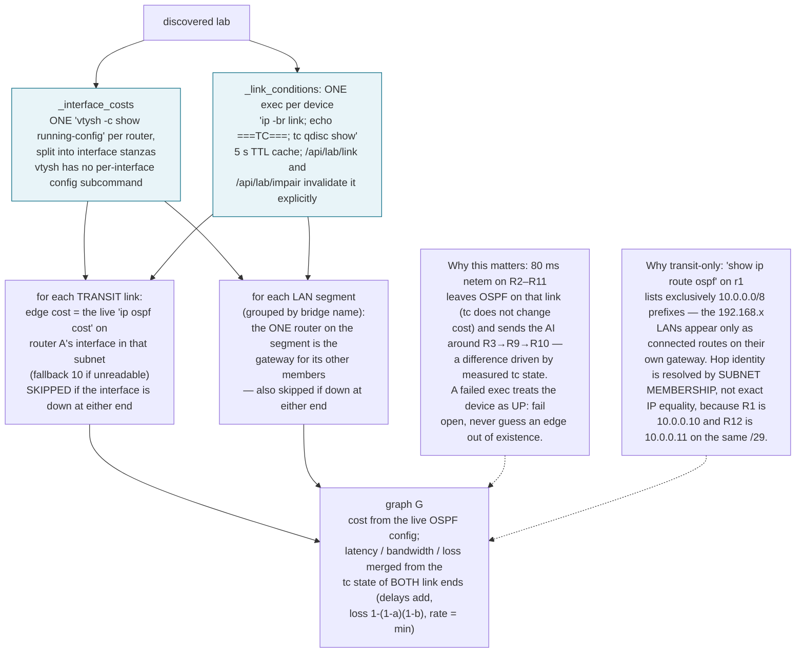

---

## 8. `_rib_walk` — walking the OSPF RIB

`backend/ospf_ai_service.py:812`

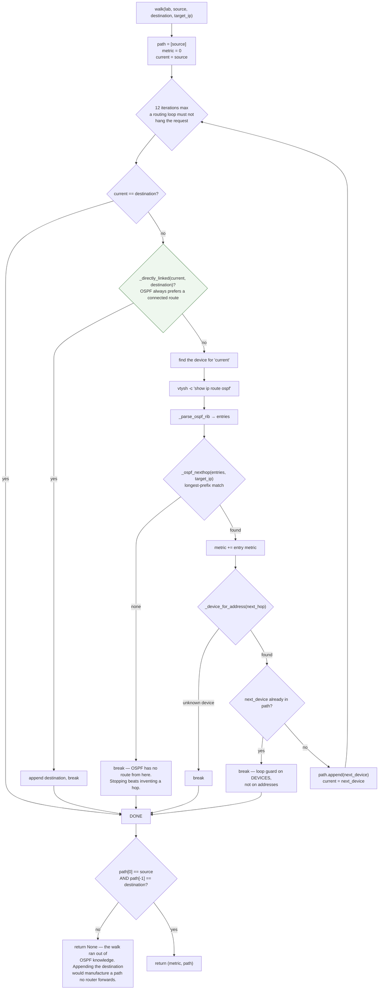

### The `directly_linked` check is the fix for "no valid path"

Without it the walk kept consulting the RIB and could be sent back the way it came:
asking R2's RIB for `10.5.0.2` (R11's link to R12) makes R2 point at R1 — a hop
already visited — and the caller then saw **"no valid path" on a topology with an
obvious one**.

### Multi-homed destinations

Every address of the destination is a separate OSPF destination, and on a
multi-homed router they do **not** all route the same way (R10 is reachable from R2
over its R9 link at cost 35 but over its R11 link at 40). Each address is walked and
the cheapest wins, scored by the interface costs the running routers report.

The `[110/metric]` figure in the RIB is deliberately **not** used to rank them: it
is the distance from the *advertising* router and excludes that router's own egress
cost, so two walks diverging at different routers are not comparable and the
cheaper path can lose.

---

## 9. `rank_paths` — AI path scoring

`backend/ai_route_service.py:164`

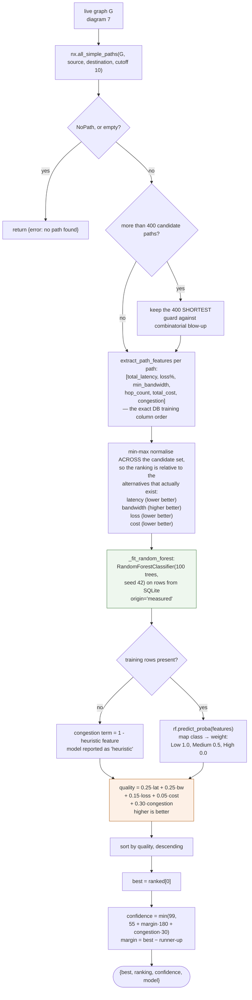

### Why not `max(predict_proba(...))`

The original implementation argmax'd a 3-class congestion classifier. That is not a
path comparison: a path can have high confidence of being *Low* congestion while
another path is strictly better on every axis, and the classifier has no notion of
"better path". It reliably picked the wrong route.

### What the RF contributes, and what it does not

The Random Forest contributes **exactly one term** — the congestion score, weighted
`0.30`. It does not invent any displayed measurement. Every figure in the
comparison table (latency, loss, hop count, cost, throughput) comes from a
measurement; the candidate rows in `ai_ranking` are labelled `measured: false` and
carry `ai_ranking_basis` stating they are graph estimates. Only the **selected**
path is measured — probing every candidate would mean a ping burst per path.

---

## 10. `compare_ospf_vs_ai` — the Analytics run

`backend/ospf_ai_service.py:471` · `POST /api/analytics/live`

```mermaid
flowchart TD
    REQ["source, destination, method, packet_count=12"] --> DISC["discover_lab()"]

    DISC --> ONLINE{"lab online?"}
    ONLINE -- no --> E1["LabUnavailable → 503<br/>'Lab not running'"]
    ONLINE -- yes --> MEMBERS{"both endpoints in<br/>the lab's ip_index?"}
    MEMBERS -- no --> E2["LabUnavailable: not part of<br/>the running lab"]
    MEMBERS -- yes --> METHOD{"method in ROUTING_METHODS?<br/>{ospf, ai}"}
    METHOD -- no --> E3["LabUnavailable: unknown method"]
    METHOD -- yes --> G["G = lab_graph(lab)"]

    G --> OSPFPATH["resolve OSPF path — diagram 7<br/>RIB → traceroute → raise with diagnosis"]
    OSPFPATH --> OSPFM["_measure_path_hops(ospf) — diagram 11"]
    OSPFM --> AIPATH["rank_paths(G, s, d) — diagram 9"]
    AIPATH --> AIM["_measure_path_hops(ai)"]

    AIPATH --> E2E

    subgraph E2E["End-to-end, from the real source container"]
        direction TB
        E0["measure_path(source, destination, count=12)"] --> ETRY["try EACH of the destination's addresses<br/>in turn — a multi-homed device may have<br/>one that is unroutable from here.<br/>First one that answers wins."]
        ETRY --> ETR["traceroute, up to 3 attempts with<br/>-i 1 -q 1 — FRR rate-limits ICMP replies,<br/>so one run can return '*' mid-trace.<br/>The most complete run wins, earlier<br/>answers kept where a later run blanks."]
        ETR --> ERES["resolution = 100/12 = 8.33%<br/>loss is a ratio of whole packets:<br/>6 packets cannot express a loss<br/>below 17%, so one drop read as 1/6"]
    end

    E2E --> RESOLVE["resolve_traced_hops — map each hop's<br/>ANSWERING ADDRESS back to its device.<br/>The address is the only thing that<br/>identifies which router forwarded it."]
    RESOLVE --> GAPS{"any hop with no owner<br/>('?hopN') in the chain?"}
    GAPS -- yes --> INCOMPLETE["path_taken_complete = false<br/>path_taken = []<br/>path_taken_gaps = the holes"]
    GAPS -- no --> COMPLETE["path_taken = the walked chain"]

    INCOMPLETE --> VERDICT
    COMPLETE --> VERDICT["_matches_method / _forwarding_method:<br/>which methods does the traced path<br/>AGREE with, and which single method<br/>does it correspond to?"]

    VERDICT --> ACTIVE["_active_method — report in_effect honestly:<br/>'the routers are forwarding this path'<br/>vs 'selected, but the routers are still<br/>forwarding OSPF; apply to install a route'"]
    ACTIVE --> BUILD["_build_comparison — diagram 12"]
    BUILD --> DIAG{"_diagnose — explain WHY<br/>if unreachable"}
    DIAG --> CONV{"convergence requested<br/>and a transit link exists?"}
    CONV -- yes --> CONVM["measure_convergence — diagram 16"]
    CONV -- no --> OUT
    CONVM --> OUT(["200: ospf, ai, comparison rows,<br/>path_taken, end_to_end,<br/>ai_ranking, model, confidence,<br/>active, convergence"])

    style E2E fill:#e8f4f8,stroke:#0d6e85
    style VERDICT fill:#eef7ee,stroke:#3d7a3d
```

### Why 12 packets

Loss is a ratio of whole packets, so with *N* requests the smallest loss expressible
is `1/N`. At the old `N=6` one dropped packet read as "17% loss" and no figure below
that was possible at all. At `N=12` a single drop reads as 8%, and `1%` would need
`N=100`. The response therefore carries `loss_resolution_percent` so the UI can
state the precision it actually had instead of implying more.

### Gapped chains are reported, not reconciled

A hop nobody answered for leaves a hole in the chain, so the walked path cannot be
compared against a computed one. Reporting a *mismatch* there would invent a fact;
claiming a *match* would be worse. The page shows the gaps.

---

## 11. `_measure_path_hops` — the noise floor

`backend/ospf_ai_service.py:352`. This is where latency becomes trustworthy.

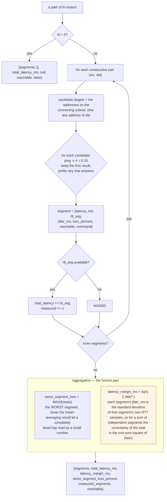

### Why the margin exists at all

Every hop in this lab is a veth pair, which has **no real propagation delay** — a
four-hop path measures around 0.4 ms, essentially all of it Linux scheduling jitter
between separate `docker exec` spawns. Measured on an *unchanged* path:

```
R1 → R9, six runs:  0.304  0.412  0.352  0.389  0.331  0.367  ms
                    spread 0.108,  stdev 0.045
```

On `R12 → R9` the OSPF-minus-AI difference fell **inside the measured spread in 5
of 6 runs** — yet the table printed a winner and a precise percentage. The numbers
were honest; the conclusion drawn from them was not. Carrying the margin beside
every figure lets the comparison decide in diagram 12.

---

## 12. Latency verdict — is the gap real?

`backend/ospf_ai_service.py:1186` · `_build_comparison`. Invariant **I5**.

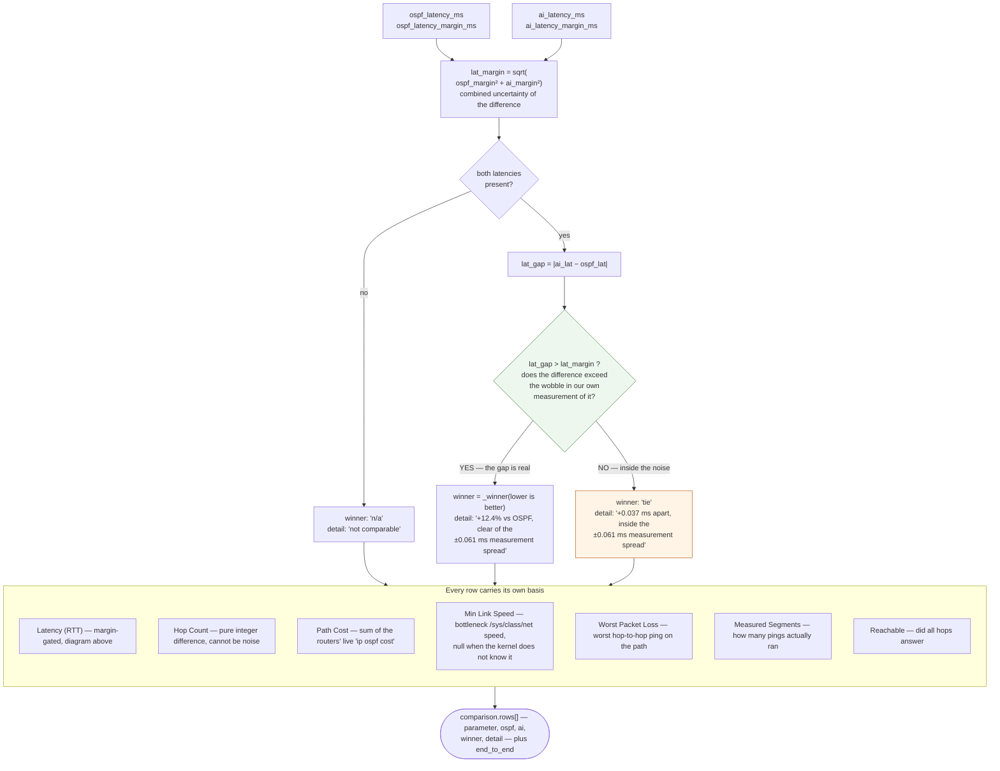

`detail` is a rendered column, not a debug field — the reader can see *why* a row
says what it says.

### One row is decorative in this lab

**Min Link Speed** reads `10000 Mbps` on every path because all veths report the
same synthetic 10 Gbps. It can never discriminate between two paths in this lab, so
that row cannot decide anything. The real capacity figure is measured throughput
(diagram 15), which reads ~6.58 Mbps on a clean link. `link_speed_mbps` returns
`None` on `-1`/0 rather than substituting a plausible default.

---

## 13. Steering the data plane

`backend/route_steer.py` · `POST /api/lab/route`

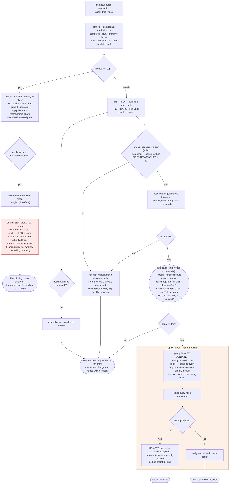

### Why pinning only the source is insufficient

Tried and measured: pinning R1 alone to send via R2 produced
`R1 → R2 → R3 → R12 → R11`, because **R2's own OSPF still chose its own way onward**.
Only the first hop was pinned. Static routes must be installed on every transit hop.

### "Select OSPF" and "revert to OSPF" are one operation

The endpoint used to short-circuit on `method: "ospf"` and report *"OSPF is what the
routers already forward with nothing injected"* **without checking whether anything
had been injected**. The pinning static routes stayed on every hop and the routers
kept forwarding the deselected AI path while the response claimed no change was
needed. `apply: false` and `method: "ospf"` now share the removal path, and the UI
enables *Revert to OSPF* whenever the routers are forwarding something other than
the OSPF path — which includes the exact state where OSPF is selected *because*
steering to AI left it in effect.

`dijkstra` is rejected with a clean **503**, not a 500: `path_for_method` raises
`LabUnavailable`, which the handler converts.

---

## 14. `apply_impairment` — tc chaining

`backend/metrics_collector.py:701` · `POST /api/lab/impair`

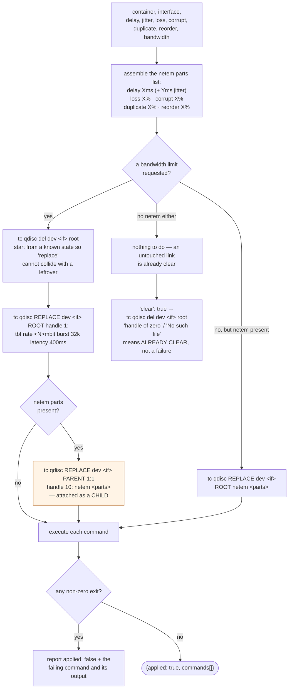

### Why tbf is the root and netem is a child

An interface can have only **one root qdisc**. Installing both as `root` means the
second `add` is rejected with "File exists", the rate limit is **silently never
applied**, and the link looks loaded in the request while carrying no real queue
pressure. Chaining `tbf` (root) with `netem` (child under `parent 1:1`) is the
arrangement that actually produces backlog and drops.

Verified: 80 ms netem on `r1/eth0` produced 80.285 ms latency and 3 qdisc drops.
Queue length and qdisc drops are legitimately `0` on a clean link.

---

## 15. `measure_bandwidth` — real throughput

`backend/metrics_collector.py:585` · `POST /api/lab/bandwidth`

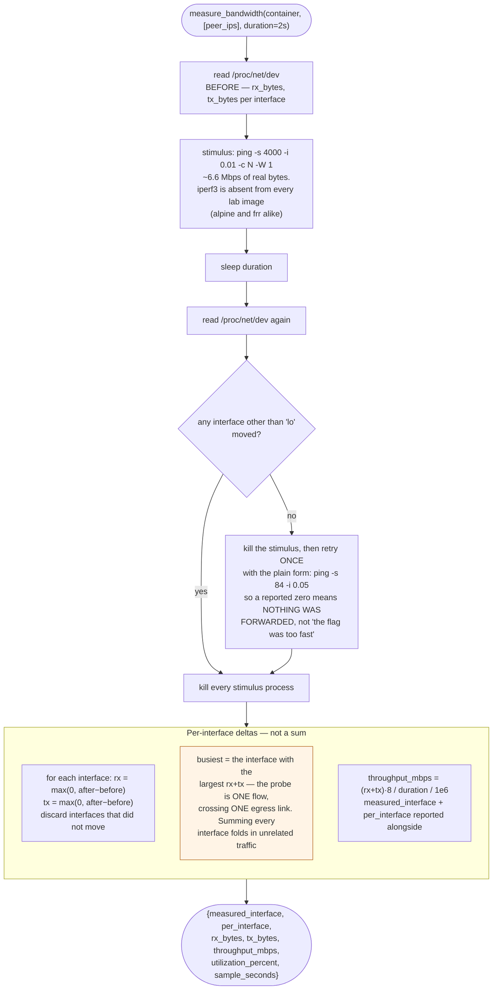

### Two corrections encoded here

- **The requested destination is the one measured.** The endpoint used to ignore
  `destination` and ping every adjacent peer, so the throughput figure sat beside a
  latency/loss/hop count for a *different* pair. Adjacency was never necessary: the
  counters being sampled are the source container's own, and they move for a remote
  destination exactly as for a neighbour. R1→R9 across three hops and two areas
  moved 822 KB in the same 2 s sample that R1→R2 did.
- **A heavy stimulus or it measures the packet rate.** `ping -i 0.05` on a default
  84-byte echo request offers about 0.03 Mbps of load — that is a packet rate, not a
  link rate.

Verified responsive to shaping: R12→R5 reads 6.576 Mbps, 3.411 Mbps under
`tc tbf rate 2mbit` on `r12/eth0`, 6.576 Mbps cleared.

---

## 16. `measure_convergence` — timed failure

`backend/convergence.py:30` · `POST /api/lab/convergence`

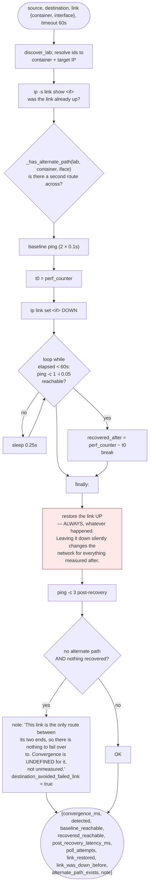

### Why the timeout is 60 s and three fields exist

OSPF's dead timer is **40 s**. A link carrying the only route to the destination
stays unreachable until it expires, and the adjacency rebuild takes a few more
seconds — a timeout below ~45 s reports `detected: false` for a case that is
working correctly.

- `link_restored` / `link_was_down_before` distinguish *"we put it back"* from
  *"we found it broken and left it that way"*.
- `alternate_path_exists` records that false convergence is a property of the
  *topology*, not of OSPF. On a cut edge (R2–R4, R4–R5, R4–R6) there is nothing to
  converge to.
- `destination_avoided_failed_link` catches the other false positive: a cut link can
  "converge" instantly when the measured pair never used it — R2→R6 does not cross
  R4–R5 — and calling that a convergence time measures a link the traffic avoided.

---

## 17. OSPF area change

`backend/ospf_area.py` · `GET/POST /api/lab/ospf/area`. The rules live in the
backend, not the UI, so they hold for any caller.

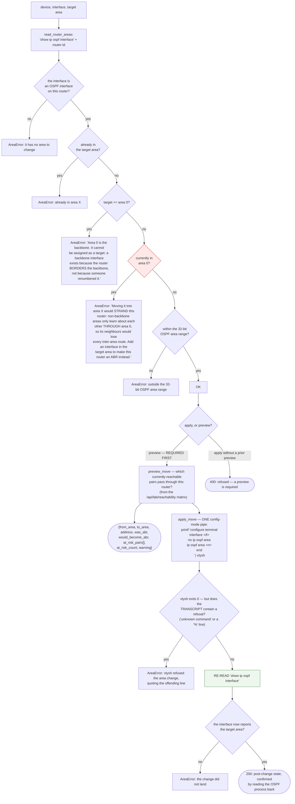

### Two FRR behaviours that make read-back mandatory

1. `ip ospf area <n>` **does not overwrite** an existing area — FRR answers
   `Must remove previous area config before changing ospf area` and **still exits
   0**. So `no ip ospf area` must precede it, and only when the read-back differs.
2. Separate `-c` arguments each run in **exec mode**, so
   `vtysh -c "configure terminal" -c "interface eth0"` is rejected as an unknown
   command. Config lines go in through a `printf … | vtysh` pipe.

### Changing an area is a routing change

OSPF only forms adjacencies between interfaces in the **same** area, so moving one
side leaves the far side routing to nothing until it follows. That is why a preview
is mandatory, and why it reports the pairs at risk rather than simulating — OSPF
has no dry-run. Neighbours take one dead-timer interval (40 s) to re-form.

---

## 18. Dataset collection loop

`backend/dataset_collector.py` · `POST /api/dataset/collect`

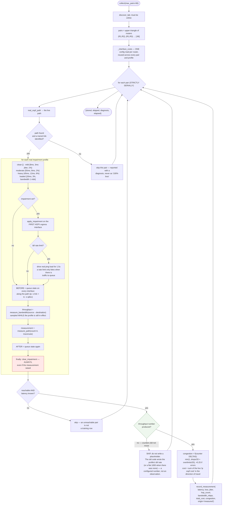

### Why it must be serial

Impairment lands on the **first hop's egress interface**, and several distinct pairs
share that interface — every R1 pair goes out of `r1`'s `eth0`. Parallel workers
would install competing `tc qdisc add root` rules on one interface, each
`clear_impairment` would tear down the others, and a 1 Mbps tbf limit would starve
unrelated measurements. That is exactly what made multi-hop pairs report as
unreachable.

### Why a clean lab is a poor teacher

Every router-to-router ping on an idle lab measures 0.1–0.8 ms with 0% loss, so
`classify()` puts **100% of rows in the "Low" band** and the Random Forest learns
nothing about congestion. Each profile is a real condition produced by real `tc`
impairment, chosen so every classification band is reachable from a real
measurement — 55 ms of netem delay lands squarely in "Medium", which the 45 ms
profile never reaches and a clean link never approaches.

---

## 19. Theme + contrast audit

`frontend/src/utils/theme.ts`, `frontend/index.html`, `scripts/audit_contrast.py`

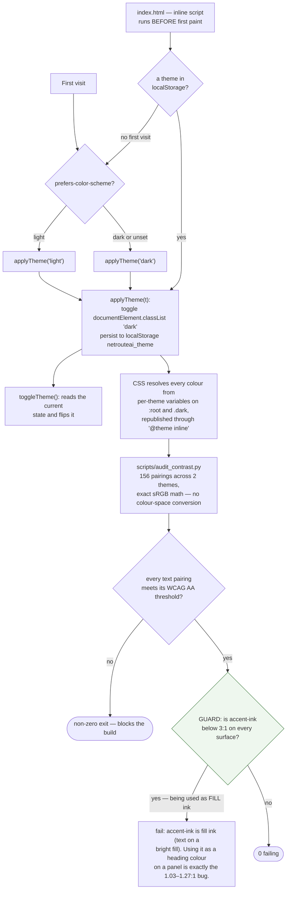

### The two inks must never be swapped

| Token | Meaning | Used for |
|-------|---------|----------|
| `accent-ink` | **fill** ink — text sitting **on** a bright accent fill | buttons, selected chips |
| `text-ink` | **reading** ink — text on panels and pages | body copy, headings, labels |

`text-accent-ink` used as a heading colour was the original invisible-text bug: 24
sites, including the hero headline's first half, the wordmark, the login dialog
title and the footer, all at **1.03–1.27:1**. The inverse was also present — 6
elements paired a bright fill with `text-ink`. The audit script now *guards* the
invariant rather than only measuring it.

The CLI terminal stays dark in **both** themes and has its own theme-invariant
`console-*` palette, so terminal output never responds to a theme switch.

---

## 20. Endpoint → algorithm map

| Method | Path | Handler | Algorithm |
|--------|------|---------|-----------|
| POST | `/api/lab/plan` | `resolve_plan` | **Diagram 3 + 4** — no Docker touched |
| POST | `/api/lab/deploy` | `deploy` → `resolve_plan` → `configure` | **Diagrams 5 + 6** |
| GET | `/api/lab/deploy` | `load_plan` / `deployed_lab_running` | drift check vs the canvas |
| POST | `/api/lab/deploy/teardown` | `teardown` | `compose down --volumes` |
| POST | `/api/lab/deploy/enterprise` | `deploy_enterprise` | explicit fallback lab |
| GET | `/api/lab/status` | `discover_lab` | dynamically discovered devices, links, cost histogram |
| POST | `/api/lab/ping` | `probe_ping` | literal-IP ping from one router's container |
| POST | `/api/lab/measure` | `measure_path` | **Diagram 10** E2E block |
| POST | `/api/lab/bandwidth` | `measure_bandwidth` | **Diagram 15** |
| POST | `/api/lab/impair` | `apply_impairment` / `clear_impairment` | **Diagram 14** |
| POST | `/api/lab/link` | `set_link_state` | `ip link set dev … down/up` |
| POST/GET | `/api/lab/traffic` | `traffic.py` | detached in-container ping loops |
| GET | `/api/lab/ospf/areas` | `area_inventory` | `show ip ospf interface` + derived ABR status |
| POST | `/api/lab/ospf/area` | `preview_move` / `apply_move` | **Diagram 17** |
| POST | `/api/lab/convergence` | `measure_convergence` | **Diagram 16** |
| GET | `/api/lab/reachability` | parallel sweep, full 171-pair matrix | ground truth for which pairs can work |
| GET | `/api/lab/metrics` | `collect_all` | interface + resource counters |
| POST | `/api/analytics/live` | `compare_ospf_vs_ai` | **Diagrams 7, 8, 10, 11, 12** |
| POST | `/api/lab/route` | `steer_plan` / `apply_steer` / `revert_steer` | **Diagram 13** |
| GET | `/api/lab/routes` | `static_routes` | `show ip route static`, exact-revert capable |
| POST | `/api/dataset/collect` | `collect` | **Diagram 18** |
| GET | `/api/dataset` | row counts | measured/synthetic split, class balance |
| — | `scripts/audit_contrast.py` | — | **Diagram 19** |

---

## Appendix — the verification commands each diagram rests on

So a reader can confirm a diagram is still true:

```bash
# Diagrams 3, 4 — allocation, renumbering, overlap, order independence
backend/venv/bin/python /tmp/opencode/final_verify.py   # 29/29 end-to-end checks
python3 scripts/audit_contrast.py                       # 156 pairings, 0 failing
cd frontend && npm run lint                             # tsc --noEmit
cd frontend && npm run build
```