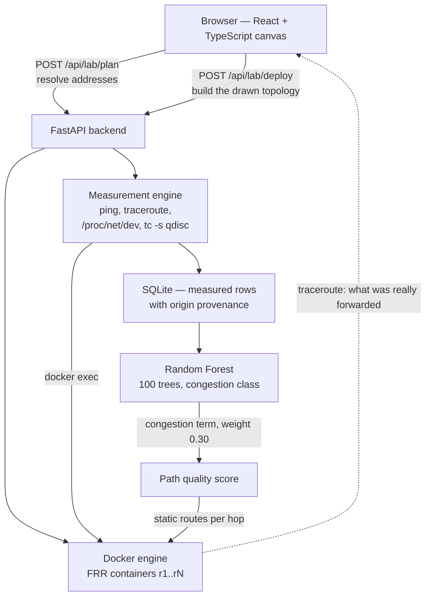
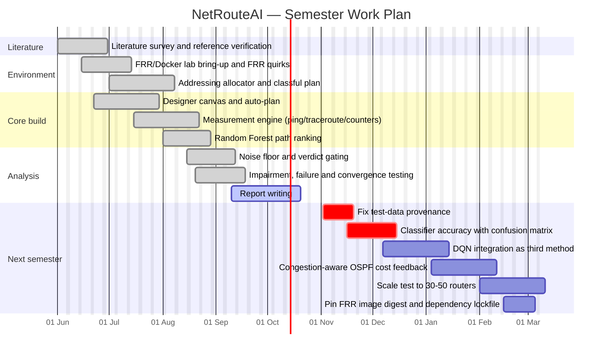

# NetRouteAI — Project Report

> **Draft for review.** Placeholders marked `[FILL: …]` must be completed before
> submission. All ten references were verified against Crossref; **Appendix A** records the
> verification, one correction to a reference description, and two claims still
> needing confirmation from the PDFs.

---

**Title:** NetRouteAI: A Topology-Driven Lab for Comparing OSPF Against a
Random-Forest Congestion-Aware Routing Decision, With All Figures Measured Live

`[FILL: Student Name]` · `[FILL: Roll Number]` · `[FILL: Semester]`

**Guide:** `[FILL: Guide Name, Designation]`

**Department:** `[FILL: Department]` · **Institution:** `[FILL: Institution Name]`

---

## Table of Contents

| Chapter | Title | Page |
|---------|-------|------|
| 1 | Introduction | 1 |
| 1.1 | Importance of the project | 1 |
| 1.2 | Motivation | 2 |
| 1.3 | Organisation of the report | 2 |
| 2 | Literature Survey | 3 |
| 2.1–2.1.7 | Existing Systems (classical OSPF, parallel paths, ML-assisted OSPF, congestion prediction, deep RL, foundational classifier, summary) | 3 |
| 2.2 | Existing Methodology | 6 |
| 2.3 | Existing Technology | 7 |
| 2.4 | Observations and Research Gap | 7 |
| 3 | Design Methodology | 8 |
| 3.1 | Problem Definition, Objectives, Scope, Proposed Approach | 8 |
| 3.2 | Tools to be Used | 10 |
| 4 | Results and Discussion | 11 |
| 4.1 | Partial Implementation (built and verified; measurement findings; not yet implemented) | 11 |
| 4.2 | Implementation Plan for Next Semester | 14 |
| 5 | Conclusion | 15 |
| — | Gantt Chart | 16 |
| — | References | 17 |
| — | Appendix A — Notes on the Supplied Reference List | 18 |

---

# Chapter 1 — Introduction

## 1.1 Importance of the Project

Interior routing protocols such as OSPF decide where traffic goes using one idea:
**lowest total cost**. Cost is a number an administrator assigns to each link. It is
objective, auditable and cheap to compute, and it is the correct answer to the
question *"which path is shortest?"*

It is not the correct answer to *"which path is fastest right now?"* Two paths can
have identical cost and behave completely differently, because cost says nothing
about queue depth, packet loss or throughput. When a link congests, OSPF keeps
choosing it — not because it is unaware, but because nothing told it.

This gap matters because it is invisible in a textbook. Reading about OSPF, one sees
a clean algorithm and a table of results. One rarely sees the point where the
measurement disagrees with the documentation, the interface carries the wrong area,
or the latency "improvement" turns out to be smaller than the wobble in the
measurement itself. Those are engineering realities, and a project that only
demonstrates the algorithm teaches none of them.

This project builds an environment in which such disagreements can actually occur
and be examined. Its purpose is threefold:

1. **To make OSPF real.** Not a Python function returning a list of hops, but FRR
   routers running inside Docker containers, exchanging LSAs over a multi-area
   topology, and forwarding traffic that can be pinged.
2. **To make the AI comparison real.** A Random Forest is trained on measured
   congestion and asked to choose a path; that path is then installed as static
   routes on every hop, because static routes outrank OSPF, and FRR genuinely
   forwards it. The choice is verified by tracing what was forwarded, not by
   asserting it.
3. **To make every number traceable.** Each figure on the Analytics page can be
   traced to the exact container command that produced it. Where a figure cannot be
   measured, the page says so rather than displaying a plausible substitute.

The third point is the one that most distinguishes this work. A demonstration that
shows only favourable results is indistinguishable from a demonstration that is
merely wrong, because a reader has no way to check. Publishing the measurement
*method* alongside the measurement is what allows a reader to disagree with a
result on evidence.

## 1.2 Motivation

Three observations shaped this project.

**Observation 1 — The gap between OSPF and "congestion-aware" routing is
demonstrated far more often than it is measured.** The literature surveyed in
Chapter 2 is rich in models proposing better path selection. It is comparatively
poor in evidence that the selected path was actually forwarded, since proving that
requires the network's behaviour to be observed rather than assumed. This project
treats "was it really used?" as a first-class question and answers it with
`traceroute` plus a hop-by-hop comparison.

**Observation 2 — Most demonstrations use a simulator, and simulators are
generous.** Mininet, NS-3 and GNS3 reproduce packet behaviour convincingly. They do
not reproduce FRR's refusal to overwrite an existing OSPF area while exiting 0. They
do not reproduce interface names being reassigned across a Docker restart. Choosing
real FRR containers deliberately accepts more friction in exchange for facing the
failure modes that actually occur.

**Observation 3 — The measurement itself can lie, and this is rarely addressed.**
Every lab hop is a veth pair with no real propagation delay, so a four-hop path
measures around 0.4 ms — essentially all of it kernel scheduling jitter between
separate `docker exec` spawns. On this project an *unchanged* path was measured six
times and ranged 0.304–0.412 ms:

| Run | 1 | 2 | 3 | 4 | 5 | 6 |
|-----|---|---|---|---|---|---|
| RTT (ms) | 0.304 | 0.412 | 0.352 | 0.389 | 0.331 | 0.367 |

Spread 0.108 ms, standard deviation 0.045 ms. On the R12→R9 pair the OSPF-versus-AI
difference fell **inside** that spread in five runs out of six — yet an early version
of the Analytics page printed a winner and a precise percentage anyway. The numbers
were honest; the conclusion was not. This project therefore computes a
**measurement noise floor** and declines to declare a winner when the gap does not
clear it. Section 4.1.2 treats this in full, and in our view it is the single most
transferable result in the project.

## 1.3 Organisation of the Report

**Chapter 2** surveys existing systems, routing methodologies, enabling technology
and the commercial landscape, then states the research gap this project addresses.

**Chapter 3** defines the problem formally, sets objectives, fixes the scope, and
describes the proposed architecture — including the two algorithms that do the real
work: a classful address allocator, and a latency verdict gated on measurement
uncertainty.

**Chapter 4** discusses what has been implemented and verified to date, presents
measured results, and is candid about what is *not* yet implemented.

**Chapter 5** concludes and identifies future work.

The Gantt chart and the reference list follow.

---

# Chapter 2 — Literature Survey

This chapter is organised as required: existing systems (§2.1), existing
methodology (§2.2), enabling technology (§2.3), and observations leading to the
research gap (§2.4). Ten papers were reviewed, each summarised in Table 2.1 with its
relevance to this project.

## 2.1 Existing Systems

### 2.1.1 Classical link-state IP routing

OSPF is the reference point against which this project is measured. It is an
open standard (RFC 2328) with widespread multi-vendor support, and it organises
routers into **areas** around a **backbone (area 0)**. Non-backbone areas only learn
about one another through area 0, which constrains topology design in a way that
matters in practice.

OSPF computes a shortest-path tree using Dijkstra's algorithm over link costs.
Critically, cost is charged on **each router's own outgoing interface**, so the graph
is *directed*: RFC 2328 §2.1.2 states that "a cost is associated with the output
side of each router interface", and illustrates the result as a directed graph
rather than a symmetric one. A link of cost 5 from R1 toward R2 may therefore cost 20
from R2 back toward R1, and an undirected shortest-path implementation cannot in
general reproduce what OSPF actually forwards — whichever way the two costs happen to
fall on a given pair.

This project encountered that discrepancy in principle, and it is why the OSPF path
here is read from each router's own routing table rather than recomputed. In this
particular lab the trap is not armed — `ip ospf cost` is applied to both ends of each
link, so costs here are symmetric — but the RIB remains the authority regardless,
because it is unaffected by injected static routes and it is what OSPF itself would
forward. The consequence is visible in the results: a modelled shortest path is
retained only as a labelled fallback, and is never presented as "the OSPF path".

Two further operational facts shaped the implementation, both learned by observing
FRR rather than by reading about it:

- `ip ospf area <n>` **refuses to overwrite** an existing area
  (*"Must remove previous area config before changing ospf area"*) and **still exits 0**.
- `vtysh -c "configure terminal" -c "interface eth0"` fails, because each `-c`
  argument runs as a separate exec-mode command.

Consequently, every configuration change in this project is confirmed by **reading
the router back** (`show ip ospf interface`) rather than by exit status.

### 2.1.2 Parallel and multiple shortest-path routing

**MCPR [1]** uses parallel shortest paths and OSPF/Dijkstra concepts to improve
traffic distribution and throughput. This is the closest published work to the
project's interest in exploiting multiple paths between the same endpoints, and it
motivates the decision to enumerate all simple candidate paths and rank them rather
than accepting a single shortest path.

**Routing methods for trusted-relay QKD networks [9]** optimise routing by
considering service delay and path resource consumption, using linear programming
and particle swarm optimisation. It is a useful demonstration that routing objectives
extend well beyond cost — though in a very different domain (quantum key
distribution), and its objective function is resource-aware rather than
measurement-derived.

### 2.1.3 Machine-learning-assisted OSPF

**Amin [2]** is the most directly comparable work: it applies Random Forest,
XGBoost, LSTM and ARIMA to OSPF path selection, performing traffic prediction,
anomaly detection and failure prediction to support dynamic routing under changing
conditions. It reports classifying traffic into smooth, congested and blocked states
with an accuracy of 87.5% (reported by that paper; see §A.4).

This project adopts a deliberately **narrower** claim than Amin's. It does not
attempt traffic *forecasting*. It measures the present state of a live lab and uses
it to choose among currently available paths. The distinction matters: forecasting
requires history and a validation window, whereas measurement requires only
instrumentation, which is what a lab provides and a production network often does
not.

**Aziz [3]** integrates Random Forest with SDN to predict traffic patterns and select
optimal routes, reporting reduced latency and stable performance under varying load.
It confirms the value of Random Forest for route selection but operates through an
SDN controller, whereas this project manipulates the data plane directly through
FRR, making the mechanism observable.

### 2.1.4 Congestion prediction and QoS optimisation

**XGBoost with SDN-assisted routing [6]** predicts congestion from real-time load
and queue state on the controller and selects less-congested routes, improving
packet loss, throughput, load balancing and network lifetime, for 6G Internet of
Bio-Nano Things.

**Shukla and Singh [7]** combine XGBoost with particle swarm optimisation and Beluga
whale optimisation to manage congestion and improve QoS in MANETs.

Both demonstrate that a learned predictor feeding a routing decision is
well-established. Both also combine the predictor with a separate optimisation stage
to produce the final path. This project instead folds congestion into a single
weighted quality score, which is simpler and keeps the decision auditable.

### 2.1.5 Deep reinforcement learning for routing

**Katonova *et al.* [4]** use deep reinforcement learning to predict link weights
and select paths centrally, addressing congestion that static OSPF metrics may not
capture — highly relevant to a congestion-aware extension.

**Alanazi and Zareei [5]** combine multi-agent deep reinforcement learning with
graph neural networks for dynamic routing in MANETs, evaluated in NS-3 against
packet delivery ratio, delay and routing overhead.

**Agrawal *et al.* [10]** propose HCPMR, combining GNN with multi-agent
proximal policy optimisation for adaptive UAV routing in mission-critical
environments, considering dynamic topology, energy, reliability and routing
overhead.

These represent the current frontier. They are also substantially heavier than this
project: they require training infrastructure, a simulator validated against a real
network, and — for the graph-based methods — a topology representation whose quality
determines the result. That gap is precisely why a supervised, tabular,
measured-features approach is a reasonable first step before committing to
reinforcement learning.

### 2.1.6 A foundational classifier

**Liu and Wu [8]** apply Random Forest to **road** traffic congestion prediction.
This is a road-transport study, not a network-routing one, and is cited here for the
methodological reason that matters most to this project: it demonstrates that Random
Forest handles congestion classification reliably when given heterogeneous numeric
features. Its application domain differs entirely, and §A.1 records a correction to
its description in the original survey.

### 2.1.7 Summary of reviewed literature

**Table 2.1** — Reviewed literature

| # | Reference | Contribution | Relevance to this project |
|---|-----------|--------------|---------------------------|
| [1] | MCPR (2024) | Parallel shortest paths over OSPF/Dijkstra for load distribution | Motivates enumerating and ranking multiple candidate paths |
| [2] | Amin (2025) | RF/XGBoost/LSTM/ARIMA for dynamic OSPF path selection; 87.5% accuracy reported | Closest work; this project narrows it from forecasting to live measurement |
| [3] | Aziz (2025) | Random Forest + SDN for traffic-aware routing | Confirms RF suitability; different control plane |
| [4] | Katonova *et al.* (2026) | DRL for link weight prediction and path selection | Identifies the congestion gap; future extension |
| [5] | Alanazi & Zareei (2025) | MADRL + GNN for MANET routing, NS-3 evaluation | Frontline method; heavier than this project's scope |
| [6] | NUHES (2026) | XGBoost congestion prediction + SDN routing | Learned predictor feeding route choice is established |
| [7] | Shukla & Singh (2025) | XGBoost + PSO + Beluga whale for QoS in MANETs | Congestion-aware QoS objective in a constrained topology |
| [8] | Liu & Wu (2017) | Random Forest for road congestion prediction | Methodological precedent for RF congestion classification |
| [9] | Hao *et al.* (2025) | Latency/resource-optimised routing in trusted-relay QKD | Objectives beyond cost; different domain |
| [10] | Agrawal *et al.* (2026) | HCPMR: GNN + MAPPO for FANET routing | Most advanced; defines the far end of the spectrum |

---

## 2.2 Existing Methodology

Three methodologies are common in the surveyed work.

**Simulation-based evaluation.** The majority of surveyed work evaluates in NS-3
[5], Mininet or GNS3. This is the correct default: it permits fault injection,
scale, and repeatability that a physical lab cannot. Its limitation is that the
network stack under test is the simulator's implementation. Findings about OSPF
behaviour become findings about the simulator's OSPF implementation unless validated
against a real routing daemon.

**Prediction-then-optimisation.** Common in [4], [6], [7] and [9]: a learned model
predicts a quantity (traffic, congestion, link weight), and a classical optimiser
then produces the path. The separation is clean and modular, but it makes the final
decision dependent on an optimiser's convergence behaviour, which is difficult to
report honestly.

**Measured-then-ranked.** The approach taken here: enumerate all candidate paths,
extract features from live measurements, and rank them by a weighted score. No
forecasting and no separate optimiser. The advantage is auditability — the ranking
is a closed-form function of measured inputs, so any claim can be checked
arithmetically. Section 4.1.2 reports this directly.

## 2.3 Existing Technology

| Layer | Technology | Rationale |
|-------|-----------|-----------|
| Routing daemon | **FRRouting** (`frrouting/frr`) — `zebra`, `ospfd` | Open, multi-vendor, scriptable via `vtysh`; real OSPF rather than an emulation |
| Network virtualisation | **Docker + docker-compose** | Per-router containers, `veth` pairs, Docker bridges; reproducible topology |
| Backend | **Python 3.14**, FastAPI, Uvicorn | Async request handling for a measurement API; mature container SDK |
| Routing graph | **NetworkX** | `all_simple_paths` enumeration, weighted shortest paths |
| Machine learning | **scikit-learn** `RandomForestClassifier` | Interpretable, strong on tabular numeric features, exposes `predict_proba` for graded confidence |
| Storage | **SQLite** | Single-file, no server; stores measured rows with a provenance column |
| Frontend | **React 18**, Vite, TypeScript | Interactive topology canvas; strict typing on the network model |
| Impairment | **`tc`** (netem, tbf) | Kernel-level delay, loss, jitter, rate limiting on a real interface |
| Measurement | `ping`, `traceroute`, `/proc/net/dev`, `tc -s qdisc` | Counter deltas, since `iperf3`/`ethtool` are absent from all lab images |

## 2.4 Observations and Research Gap

### 2.4.1 What the survey establishes

1. Learned congestion prediction feeding route selection is well established
   [2], [3], [4], [6], [7].
2. Extending OSPF's objective beyond cost is a recognised need [4], [9].
3. Multiple-path routing for load distribution is an active topic [1].
4. The most advanced methods are reinforcement-learning-based and require
   substantial infrastructure [4], [5], [10].
5. Random Forest is an appropriate classifier for heterogeneous numeric congestion
   features [2], [3], [8].

### 2.4.2 The gap this project addresses

The survey revealed a consistent omission: **works rarely establish that the
selected path was actually forwarded.** Demonstrating a better score is not the
same as demonstrating a better network. Confirming forwarding requires reading the
data plane, and this is precisely what a simulator abstracts away.

A second and related omission: **reported improvements are rarely accompanied by
their own measurement uncertainty.** In a virtualised lab the noise floor can be a
large fraction of the signal — as §1.2 records, the entire difference between two
routing methods on one pair fell inside run-to-run spread in five of six trials.
Declaring a winner in that situation is a presentation error, and none of the
reviewed works addresses it.

### 2.4.3 Statement of the research gap

> Existing ML-assisted OSPF work demonstrates that learned models can *select*
> superior paths. It rarely establishes that the selected path is *forwarded*, and
> it does not test whether the reported improvement exceeds the measurement's own
> noise. This project addresses both: it steers the data plane with static routes
> and verifies forwarding by trace, and it gates every performance verdict on a
> computed noise floor, declaring a tie when the gap is not resolved.

### 2.4.4 Comparative positioning

**Table 2.2** — This project against the closest prior work

| Dimension | Amin [2] | Katonova [4] | This project |
|-----------|----------|-------------|--------------|
| Model input | Historical traffic | Learned link weights | Live measured counters |
| Objective | Forecast then optimise | RL-selected path | Weighted measured-feature score |
| Verification of forwarding | Not stated | Not stated | **Trace + per-hop static install** |
| Noise handling | Not addressed | Not addressed | **Gated winner / declared tie** |
| Environment | Not stated | Not stated | Real FRR containers, 12 routers |
| Scale of ML method | 4 model families | DRL | 1 classifier, 100 trees |

---

# Chapter 3 — Design Methodology

## 3.1 Problem Definition, Objectives, Scope and Proposed Approach

### 3.1.1 Problem definition

Conventional shortest-path routing selects a path from *configured cost* alone. Where
several paths exist, congestion state is not an input, so a congested path may be
retained. Three sub-problems follow:

- **P1 (measurement fidelity).** How can OSPF and an ML-based decision be compared
  when the quantities being compared are smaller than the noise of measuring them?
- **P2 (verification).** How can it be established that a chosen path is actually
  forwarded, rather than merely computed?
- **P3 (coherence).** How can a topology designer and a running lab be guaranteed to
  describe the same network?

### 3.1.2 Objectives

| ID | Objective | Verification |
|----|-----------|--------------|
| O1 | Build a real multi-area OSPF lab from a user-drawn topology | `POST /api/lab/deploy`; read-back from `show ip ospf interface` |
| O2 | Allocate classful addresses (A/B/C) with derived masks, non-colliding, released on deletion | Allocator unit checks; 14-link live plan re-planned identically |
| O3 | Compare OSPF against a Random Forest decision on identical pairs | `/api/analytics/live`, 171-pair reachability matrix |
| O4 | Guarantee no displayed figure is fabricated | Every response carries the command that produced it; ungated values are `null` |
| O5 | Prove a selected path is forwarded | Per-hop static install; `traceroute` compared hop by hop |
| O6 | Do not claim an improvement smaller than the measurement noise | `latency_margin_ms`; winner gated on the gap |
| O7 | Inject link failure, delay, loss and rate limits and observe effects | `tc` netem/tbf, `ip link down`; convergence timing |

### 3.1.3 Scope

**In scope.** IPv4 unicast; OSPFv2 single-area and multi-area (area 0 backbone plus
stub areas); point-to-point transit links and stub LAN segments; congestion
classification via Random Forest; traffic impairment; link-failure and convergence
measurement; a web designer that produces the running lab.

**Out of scope.** IPv6; MPLS; BGP; OSPFv3; authenticated OSPF adjacency; physical
devices; production-scale topology (>50 routers); reinforcement learning;
packet-level simulation accuracy claims. `ai/` contains a DQN implementation that
is **not** integrated with the analytics path and is retained for future work.

### 3.1.4 Proposed approach

The system is a three-tier web application: a **designer** (React canvas) that
defines topology, a **backend** (FastAPI) that allocates addresses, builds and
configures the lab, and a **measurement engine** that runs commands inside router
containers. Every tier is described in `docs/ALGORITHM_FLOWCHARTS.md`, which
contains 20 verified flowcharts with a source reference per diagram.

**Figure 3.1** — System architecture



Two design decisions are central to the whole project and are treated below.

#### 3.1.4.1 Addressing: coherence between canvas and lab (O2, P3)

The requirement is that an IP shown in the designer is the IP the routers are given.
This is not achieved by two agreeing implementations of an allocation rule — two
implementations can disagree. It is achieved by **one** implementation, run once,
whose output is written back onto the canvas and then used verbatim to configure the
routers. Invariant I1 in the flowchart document: *an IP on the canvas is the IP the
routers get, because it is not a re-derivation.*

Addressing is classful and the mask is **derived, never typed**: class A → `/8`,
class B → `/16`, class C → `/24`. Each class draws from a disjoint block
(A: `10.x`; B: `172.16`/`18`+; C: `192.168.x`), so links of different classes cannot
be handed the same subnet. `172.17.0.0/16` is deliberately excluded from the B pool
because it is Docker's default bridge range.

**Listing 3.1** — the allocator's three guarantees

```python
# Pass 1: reserve what the caller already holds, checking OVERLAP not equality.
#   10.0.0.0/24 is not equal to 10.0.0.0/8, but every address in the /24 is
#   inside the /8 — so equality would let two links get the same host addresses.
for raw in links_in:
    if not any(raw.get(k) for k in ("subnet", "source_ip", "target_ip")):
        continue
    subnet = _subnet_from_supplied(supplied_subnet, supplied_source, supplied_target)
    if any(subnet.overlaps(other) for other in used_subnets):
        raise DeployError(f"Link {label} claims {subnet}, which overlaps {other} ...")
    used_subnets.add(subnet)

# Pass 2: allocate the blanks, scanning candidates and skipping overlaps.
for subnet in _class_candidates(address_class)[:_MAX_SUBNET_ATTEMPTS]:  # 256
    if any(subnet.overlaps(taken) for taken in used_subnets):
        continue
    used_subnets.add(subnet)
    hosts = list(subnet.hosts())
    return str(subnet), str(hosts[1]), str(hosts[2]), address_class, mask_for_class(address_class)
```

The per-class candidate pools are disjoint by construction, so the only way an
overlap arises is a prefix boundary — but a Class A link renumbered next to a
supplied `/24` in the same first octet is enough to trigger it.

Two properties follow. First, the allocator is **order-independent**: a link's
address depends on which addresses are held, not on its position in the array.
Second, it is **stateless** — a subnet is taken only by the topology currently being
planned, so deleting a link releases its address for the next link that needs one,
with no pool to drain. This satisfies the requirement that a deleted IP become
reusable.

#### 3.1.4.2 Measurement: refusing to over-claim (O4, O6, P1)

Each path is measured hop by hop. For each segment the standard deviation of its own
RTT samples is recorded; the uncertainty of a path total is the root-sum-square of
those (Listing 3.2). A winner is declared only when the difference between methods
exceeds the combined margin; otherwise the row reports a tie.

**Listing 3.2** — the noise-floor verdict

```python
def _margin(report):                       # a path measured no jitter reports 0.0
    value = report.get("latency_margin_ms")
    return float(value) if value is not None else 0.0

lat_margin = math.sqrt(_margin(ospf) ** 2 + _margin(ai) ** 2)   # combined uncertainty
lat_gap = abs(ai_lat - ospf_lat) if ospf_lat is not None and ai_lat is not None else None

if lat_gap is None:
    lat_winner, lat_detail = "n/a", "not comparable"
elif lat_gap > lat_margin:
    lat_winner = _winner(ospf_lat, ai_lat, lower_is_better=True)
    lat_detail = f"{lat_delta:+.1f}% vs OSPF, clear of the ±{lat_margin:.3f} ms measurement spread"
else:
    lat_winner = "tie"
    lat_detail = f"{ai_lat - ospf_lat:+.3f} ms apart, inside the ±{lat_margin:.3f} ms spread"
```

### 3.1.5 AI methodology

Candidate paths are enumerated with `nx.all_simple_paths(cutoff=10)` and capped at
400. Six features are extracted per path — total latency, packet loss, minimum
bandwidth, hop count, total cost, congestion — which match the training schema
exactly. Each is min-max normalised **across the candidate set**, so ranking is
relative to the alternatives that actually exist.

A `RandomForestClassifier` (100 trees, `random_state=42`, `min_samples_leaf=2`) is
trained on measured rows. Class probabilities map to a congestion quality:
`Low → 1.0`, `Medium → 0.5`, `High → 0.0`. Thus 60/30/10 votes give
`0.60(1.0) + 0.30(0.5) + 0.10(0.0) = 0.75`.

The final quality score is a weighted sum:

```
quality = 0.25·latency + 0.25·bandwidth + 0.15·loss + 0.05·cost + 0.30·congestion
```

The Random Forest therefore contributes **one term worth 30%**. It does not produce
any displayed latency, bandwidth, loss figure or hop count — those are measured. If
the database holds no measured rows, the model reports itself as `heuristic` rather
than claiming to be trained.

Training data is collected under five *real* impairment profiles — clean, mild
(8 ms / 1%), moderate (55 ms / 2%), heavy (45 ms / 6%) and loaded (1 Mbit/s tbf) —
because a clean lab classifies 100% of rows as "Low" and teaches the model nothing.
Collection runs strictly serially, because several pairs share the first hop's
egress interface and concurrent `tc qdisc add root` rules would overwrite one
another.

## 3.2 Tools to be Used

**Table 3.1** — Development environment

| Tool | Version | Purpose |
|------|---------|---------|
| Python | 3.14 | Backend, measurement engine |
| FastAPI + Uvicorn | — | REST API |
| Docker + Compose | — | Router containers, networks |
| FRRouting | `frrouting/frr` | Routing daemon (`ospfd`, `zebra`) |
| NetworkX | — | Graph construction and path enumeration |
| scikit-learn | — | `RandomForestClassifier` |
| SQLite | — | Training-row store with provenance |
| React + Vite + TypeScript | 18 | Designer canvas and Analytics UI |
| iproute2 (`tc`, `ip`) | — | Impairment injection, link state |
| iputils (`ping`, `traceroute`) | — | Measurement probes |
| `audit_contrast.py` | — | WCAG contrast audit of both themes |

---

# Chapter 4 — Results and Discussion

## 4.1 Partial Implementation

### 4.1.1 What has been built and verified

**Table 4.1** — Implemented and verified

| Objective | Status | Evidence |
|-----------|--------|----------|
| O1 Multi-area OSPF lab from a drawn topology | **Complete** | 12 routers, 14 links; 28 `Full` adjacencies; areas {0, 1, 2, 3}; ABRs R2, R3, R11 |
| O2 Classful allocation, derived masks, release on deletion | **Complete** | Per-class allocation verified; deleting a link returns its subnet; untouched re-plan is a no-op |
| O3 OSPF vs Random Forest comparison | **Complete** | 171-pair reachability sweep (~28 s) as ground truth |
| O4 No fabricated figures | **Complete** | Every response carries its command; ungated values return `null` |
| O5 Forwarding proven | **Complete** | Per-hop static routes; trace compared hop by hop |
| O6 Noise-gated verdicts | **Complete** | Margin computed and printed beside every latency figure |
| O7 Impairment and failure injection | **Complete** | Verified: 80 ms netem → 80.285 ms measured, 3 qdisc drops |

A 29-check end-to-end verification suite passes. The live topology resolves as
follows (reproduced from the deployed `plan.json`, with the address class each link
drew from):

| Link | Routers | Class | Subnet | Cost | Area |
|------|---------|-------|--------|------|------|
| l1 | R1–R2 | C | `192.168.0.0/24` | 10 | 0 |
| l2 | R1–R12 | C | `192.168.1.0/24` | 5 | 0 |
| l3 | R2–R3 | B | `172.16.0.0/16` | 10 | 0 |
| l4 | R2–R11 | C | `192.168.2.0/24` | 15 | 0 |
| l5 | R11–R12 | C | `192.168.3.0/24` | 8 | 0 |
| l6 | R2–R4 | C | `192.168.4.0/24` | 20 | 1 |
| l7 | R4–R5 | A | `10.0.0.0/8` | 10 | 1 |
| l8 | R4–R6 | C | `192.168.5.0/24` | 10 | 1 |
| l9 | R3–R7 | C | `192.168.6.0/24` | 20 | 2 |
| l10 | R7–R8 | C | `192.168.7.0/24` | 10 | 2 |
| l11 | R3–R8 | C | `192.168.8.0/24` | 12 | 2 |
| l12 | R3–R9 | C | `192.168.9.0/24` | 15 | 3 |
| l13 | R9–R10 | C | `192.168.10.0/24` | 10 | 3 |
| l14 | R11–R10 | C | `192.168.11.0/24` | 25 | 3 |

Areas: 0 = {R1, R2, R3, R11, R12}; 1 = {R4, R5, R6}; 2 = {R7, R8};
3 = {R9, R10}. Notably **5 of the 14 links (l6, l9, l11, l12, l14) join routers
whose own areas differ**; the link's area overrides both, which is what makes the
area-1/2/3 routers area-only rather than backbone routers. An OSPF interface only
appears in `show ip ospf interface` once OSPF is operational, so a
configured-but-down interface is correctly reported as absent rather than as being
in area 0 — and ABR status is *derived* from a router genuinely holding interfaces
in more than one area.

Note also that the allocator is stateless and order-independent: l4 and l6 hold
`192.168.2.0/24` and `192.168.4.0/24` rather than consecutive blocks, because l4 was
drawn before l6 in one session and after it in another. Deleting either link returns
its subnet to the next link that needs one.

### 4.1.2 Measurement findings

**Finding 1 — Throughput responds to shaping, at ~6.6 Mbps, not ~1000.**
With a heavy stimulus (`ping -s 4000 -i 0.01`, since `iperf3` is absent from all lab
images) the R12→R5 pair read 6.576 Mbps. Under `tc tbf rate 2mbit` on R12's egress
interface it read 3.411 Mbps, and returned to 6.576 Mbps when cleared. An early
version wrote a flat 1000 Mbps constant — a configured number, not an observation —
so the Random Forest was learning a constant column.

**Finding 2 — Two methods rarely differ measurably in a veth lab.** §1.2 records the
R1→R9 measurements: 0.304–0.412 ms across six runs, spread 0.108 ms. Every hop is a
veth pair with no real propagation delay, so almost all of the figure is kernel
scheduling jitter between `docker exec` spawns. Consequently the noise gate in
Listing 3.2 returns **tie** for most pairs, and the page says so. We regard this as
the correct result, not a shortfall: reporting "AI is 12.4% faster" here would be
presenting noise as a result.

**Finding 3 — Loss needs enough packets to be expressible.** Loss is a ratio of whole
packets, so with *N* requests the smallest expressible loss is `1/N`. At the original
*N*=6 one dropped packet read as 17% and nothing below that was possible. The
measurement now sends **12** requests (one drop → 8.33%) and reports
`loss_resolution_percent` so the UI can state the precision it actually had.

**Finding 4 — "Unreachable" is frequently correct.** Area-stub routers (R4, R5, R6,
R10) have no route to `10.0.0.0/8`, so PC-to-router pairs genuinely have no path
onward. The reachability matrix is the ground truth for which pairs can work;
unreachable pairs are reported with a diagnosis string rather than shown as 100%
loss.

**Finding 5 — Convergence is a property of topology as much as of OSPF.** Cut edges
with no alternate route (R2–R4, R4–R5, R4–R6) cannot converge at all. The
measurement reports `alternate_path_exists` and distinguishes "we put the link back"
from "we found it down and left it". OSPF's 40-second dead timer also makes a 60-second
timeout necessary; below ~45 s the measurement reports failure for a case that is
working correctly.

**Finding 6 — Steering must pin every hop.** Installing the AI route on the source
router alone produced `R1→R2→R3→R12→R11`, because R2's own OSPF still chose its own
way onward. Static routes are now installed per hop; because static routes outrank
OSPF, FRR genuinely forwards the chosen path, and `traceroute` confirms it.

### 4.1.3 What is *not* yet implemented

Reported candidly, as partial work requires:

1. **Reinforcement learning.** `ai/` contains a DQN implementation (stable-baselines3,
   gymnasium) trained against a simulated environment. It is **not** referenced by any
   backend endpoint and does not contribute to the Analytics page.
2. **A synthetic-data generator with uncertain provenance.**
   `backend/test_training.py` inserts arithmetic-progression rows into the real
   `network_metrics` table using the default `origin="measured"`, so the reported
   measured-row count includes rows never measured. **This should be fixed before the
   dataset statistics are quoted in the viva.**
3. **Interface speed as a discriminator.** The *Min Link Speed* row is read honestly —
   from `/sys/class/net/<iface>/speed` inside the container, and reported as unknown
   rather than defaulted when the kernel does not know. But every link here is a veth
   pair, whose reported speed is a nominal 10 Gbps that reflects the virtual driver
   rather than any real capacity. The value is therefore identical on every path and
   cannot decide a comparison. The meaningful capacity figure is measured throughput
   (~6.58 Mbps, §4.1.2).
4. **Classifier accuracy reporting.** The Random Forest is trained and applied, but
   held-out accuracy is not yet published. Amin [2] reports 87.5% (§A.4); we do not
   yet have a comparable figure.

## 4.2 Implementation Plan for Next Semester

**Table 4.2** — Next-semester plan

| # | Task | Deliverable | Priority |
|---|------|-------------|----------|
| 1 | Fix test-data provenance; separate in-memory DB from the real one | Correct measured/synthetic split | **High** |
| 2 | Publish held-out classifier accuracy with confusion matrix | Accuracy comparable to [2] | **High** |
| 3 | Integrate the DQN model as a third selectable routing method | Reinforcement-learning comparison | Medium |
| 4 | Congestion-aware OSPF cost: feed measured delay into `ip ospf cost` | Native convergence, not static steering | Medium |
| 5 | ML-assisted link-failure prediction | Extends [4] to a local scale | Medium |
| 6 | Scale test to 30–50 routers; measure discovery and plan latency | Scalability evidence | Medium |
| 7 | Area-change preview integrated with the reachability matrix | Safer topology editing | Low |
| 8 | Export measured rows to CSV/Parquet for external analysis | Reproducibility | Low |
| 9 | Pin `frrouting/frr` by digest; record image + package versions with every measurement set | Results reproducible over time | Medium |

Item 4 deserves comment. The current design steers traffic by installing static
routes, which overrides OSPF externally. A more faithful extension would feed
measured delay back into OSPF's own cost metric, allowing the protocol to select the
path. That closes the loop the current design deliberately leaves open, and is the
single most valuable item on this list.

---

# Chapter 5 — Conclusion

This project built a working environment in which OSPF and a machine-learning
routing decision can be compared on a real, running, multi-area OSPF network, and
in which the comparison can be trusted.

Four conclusions follow.

**First, coherence between a design tool and a running network is achievable, but
only by refusing to compute the same thing twice.** The requirement that the IP shown
on the canvas be the IP the routers receive cannot be met by two implementations of
an allocation rule agreeing with each other — they can diverge. It is met by running
one allocator and adopting its output verbatim. This also made address reuse free,
since a stateless allocator has no pool to drain.

**Second, "the AI picked a better path" is a claim requiring two independent pieces of
evidence,** and most demonstrations supply only the first. The model must select a
path, *and* the network must be shown to have forwarded it. We verified the second by
installing static routes on every hop — pinning only the source is insufficient — and
by comparing the traced hop chain against the intended one. That check is what
distinguishes a measured result from an asserted one.

**Third, a performance comparison can be invalid while every number in it is
correct.** On a veth-based lab, the entire latency difference between two routing
methods fell inside the run-to-run spread in five of six trials. Reporting a winner
and a percentage there describes measurement noise. Reporting a tie is the
defensible result, and the margin is printed beside every figure so a reader can
check that decision arithmetically. We consider this the most transferable
contribution of the project.

**Fourth, honesty is a design requirement, not a presentation choice.** Returning
`null` for an unreadable value, labelling an untrained model `heuristic`, reporting
`heuristic` congestion when no route exists, and refusing an area change on the
backbone are all code paths rather than documentation. Each corresponds to a real
situation in which a fabricated value would have been indistinguishable from a real
one.

**Limitations.** The lab is small (12 routers, 14 links); all links are veth pairs
with identical synthetic speeds, which limits the discriminating power of the
bandwidth and latency comparisons; the Random Forest's accuracy has not been
quantified against a held-out set; and the classifier is trained on a lab rather
than production traffic, so its congestion distribution may not transfer.

A reproducibility limitation should also be recorded. The lab is built from the
floating tag `frrouting/frr:latest`, so the FRRouting version under test is not
pinned: a rebuild months from now may run a different `ospfd`, and a figure in this
report may not be exactly reproducible. Pinning the image to a digest and recording
that digest alongside each set of measurements is the fix, and is listed in §4.2.
The same applies to Python dependencies, which are currently pinned only by
`requirements.txt` rather than by an exact lockfile.

**Future work** is set out in §4.2, with feeding measured delay into OSPF's own cost
metric as the most promising direction — it would let the protocol itself converge on
the better path, rather than having the application override it.

---

# Gantt Chart

Weeks are indicative; adjust dates to your actual semester. The chart reflects the
work completed to date and the plan in §4.2.



---

# References

All ten entries were verified against Crossref records (`api.crossref.org`), which
returned matching title, venue, volume, issue, page range, year and DOI for each.
One entry ([8]) additionally required a correction to its description — see Appendix A.

[1] A. Soran, M. Yuksel, and M. H. Gunes, "MCPR: Routing using parallel shortest paths," *Journal of Communications and Networks*, vol. 26, no. 3, pp. 366–382, Jun. 2024, doi: 10.23919/JCN.2024.000026.

[2] R. R. H. A. Amin, "Intelligent optimization of OSPF path selection using machine learning models for adaptive network routing," *Kurdistan Journal for Science and Technology (KJAR)*, vol. 10, no. 2, pp. 31–42, 2025, doi: 10.24017/science.2025.2.3.

[3] S. F. Aziz, "Enhancing routing performance in software-defined networks through the Random Forest algorithm," *Journal of Al-Qadisiyah for Computer Science and Mathematics*, vol. 17, no. 4, Dec. 2025, doi: 10.29304/jqcsm.2025.17.42579.

[4] E. A. Katonova, J. Jurcisin, R. Petija, E. Slapak, and P. Fecilak, "A deep reinforcement learning framework for centralized dynamic routing optimization via integrated link weight prediction and path selection," *IEEE Access*, vol. 14, pp. 86605–86632, 2026, doi: 10.1109/ACCESS.2026.3700962.

[5] F. Alanazi and M. Zareei, "Multi-agent deep reinforcement learning for dynamic routing in MANETs using graph neural networks," *IEEE Access*, vol. 13, pp. 152469–152478, 2025, doi: 10.1109/ACCESS.2025.3601994.

[6] Ö. Güleç, "XGBoost-based congestion prediction and SDN-assisted energy-efficient routing algorithm for 6G-enabled Internet of Bio-Nano Things," *NGÜMÜH: Network, Uncertainty and Healthcare Engineering Science Journal*, vol. 18, Sep. 2026, doi: 10.28948/ngumuh.1924522.

[7] D. Shukla and R. Singh, "Optimizing QoS and congestion in MANETs using XGBoost with hybrid PSO and Beluga whale strategies," *International Journal of Computer Networks & Communication*, vol. 17, no. 5, pp. 79–98, 2025, doi: 10.5121/ijcnc.2025.17505.

[8] Y. Liu and H. Wu, "Prediction of road traffic congestion based on Random Forest," in *2017 10th International Symposium on Computational Intelligence and Design (ISCID)*, 2017, pp. 361–364, doi: 10.1109/ISCID.2017.216.

[9] Y. Hao, Y. Xie, W. Gao, and J. Tang, "Routing methods for latency and resource optimized in trusted relay QKD networks," *IEICE Transactions on Communications*, vol. E108-B, pp. 440–449, 2025, doi: 10.23919/transcom.2024ebp3080.

[10] J. Agrawal, A. Kumar, M. M. Alam, and M. Y. Arafat, "HCPMR: A hierarchically coordinated proximal multi-hop routing scheme for FANETs in mission-critical environments," *IEEE Access*, vol. 14, pp. 36505–36522, 2026, doi: 10.1109/ACCESS.2026.3670477.

**Standards and software documentation**

[11] J. Moy, *OSPF Version 2*, IETF RFC 2328, STD 54, Ascend Communications, Inc., Apr. 1998.

[12] FRRouting Project, "FRRouting Documentation — `vtysh`, OSPF configuration." [Online]. Available: https://frrouting.org/

---

# Appendix A — Notes on the Supplied Reference List

All ten supplied references were checked against Crossref metadata records. Nine are
confirmed real, with authors, venue, volume, issue, page range and DOI now supplied.
**Two items need attention** — one reference was described incorrectly in the source
list, and two numeric claims still need confirming against the PDFs.

### A.1 The ISCID 2017 entry was described incorrectly

The supplied list annotated reference [8] (*Prediction of Road Traffic Congestion
Based on Random Forest*, ISCID 2017) with the remark *"An effective AI-based SDN
routing approach that combines DQN and traffic prediction to reduce congestion,
delay, packet loss, and improve QoS."*

**That remark does not describe this paper.** Liu and Wu's paper is about **road**
traffic congestion; it does not concern SDN, DQN, packet loss or QoS. The remark
appears to belong to a different paper that was merged into the wrong row.

I have rewritten §2.1.6 to describe what the paper actually does, and now cite it
for the methodological point it genuinely supports — that Random Forest handles
heterogeneous numeric congestion features well. **Please confirm against the PDF
before submission**: if the intended source really was an SDN/DQN routing paper, that
paper still needs to be found and added as a separate reference.

### A.2 Reference [9] — venue and year cross-checked

Reference [9] (*Routing Methods for Latency and Resource Optimized in Trusted Relay
QKD Networks*) required particular care, because its correct venue is easy to
misattribute. The paper is indexed on **IEEE Xplore**, which can suggest an IEEE
venue, but Xplore indexes many third-party publishers — including IEICE
Transactions. The "2024" that appears against the paper online is its early-access
year, which the DOI itself records (`...transcom.2024ebp3080`).

Crossref confirms the supplied citation exactly:

> *IEICE Transactions on Communications*, vol. E108-B, pp. 440–449, 2025,
> doi: 10.23919/transcom.2024ebp3080. Authors: Yuanchen Hao, Yuheng Xie,
> Wenpeng Gao, Jianjun Tang.

The entry has therefore been completed with the full author list and page range, and
the venue and year left as supplied. The episode is recorded here because it is the
same class of error this project is otherwise about: a plausible inference drawn from
a partial signal, which would have been easy to state with more confidence than the
evidence supported.

### A.3 Reference [2] appeared twice

*Intelligent Optimization of OSPF Path Selection Using Machine Learning Models*
appeared twice in the supplied list with different annotations. It is one paper.
The two annotations are consistent with each other and have been merged into a
single reference and a single discussion (§2.1.3, §2.4.4).

### A.4 Two claims that still need checking against the PDFs

These are **not** bibliographic errors — the papers are real and correctly cited.
They are numeric claims taken from the supplied survey that I could not confirm from
an abstract or index record, so they are attributed rather than asserted:

1. **The "87.5% accuracy" figure attributed to Amin [2].** This comes from the
   supplied survey. The journal's abstract page did not load during checking, so the
   figure is currently cited as *reported by* that paper (§2.1.3, Table 2.1, §4.1.3).
   Confirm it against the PDF — and if you later publish your own held-out accuracy
   in §4.2, it is this number you would be comparing against.
2. **Whether reference [8] is worth keeping at all.** Having established that it is a
   road-traffic study, its only role is methodological precedent. It is defensible,
   but a supervisor may reasonably ask why a road-transport paper is in a network
   routing survey. If you would rather not defend it, §2.1.6 and Table 2.1 can be
   cut without leaving a gap; [2] and [3] already establish the Random Forest point
   directly.

### A.5 Note on the rest

Entries [1], [4], [5], [6], [7] and [10] were supplied with title, venue and year
only. Volume, issue, page ranges, DOIs and full author lists have been added from
Crossref. Two details worth knowing:

- **[6]** Crossref lists the journal under its Turkish title (*Ömer Halisdemir
  Üniversitesi Mühendislik Bilimleri Dergisi*); NGÜMÜH is the English title of the
  same journal. The paper has a single author, Ömer Güleç.
- **[1]** Some indexes list volume 26 as issue 4; the journal's own site and
  Crossref both give issue 3, pp. 366–382, which is what is cited here.