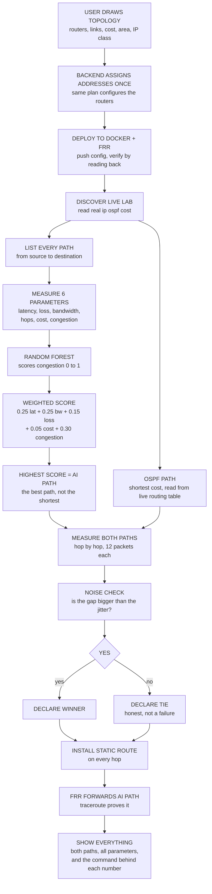
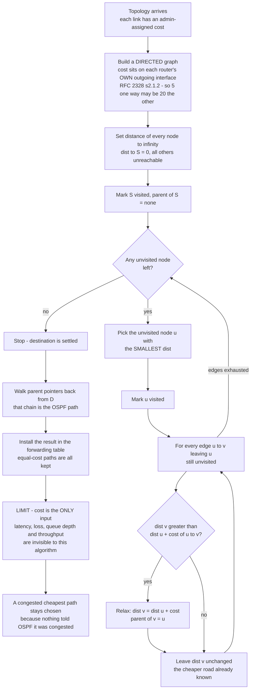
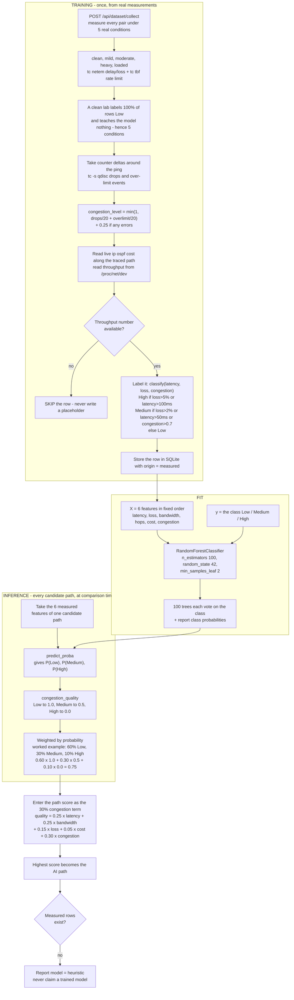

# Three Flowcharts — NetRouteAI

> **How to use these.** Each diagram is given twice: as **Mermaid source** (paste into
> <https://mermaid.live> → *Actions → PNG*, or any Markdown viewer that renders Mermaid),
> and as a **numbered box list** for tools that want explicit shapes.
>
> **Do not paste these into a raw image generator** (DALL·E, Midjourney, Gemini image
> output). Those models misspell and garble technical labels — "OSPF" reliably becomes
> "OSPF-ish" and `0.30·congestion` becomes decorative squiggles. Use a diagram renderer
> or draw.io / PowerPoint and type the labels from the box lists.

---

# Flowchart 1 — The entire project, start to end

**Objective:** choose the *best* path from live measurements, where OSPF chooses the
*shortest* path from configured cost.

```mermaid
flowchart TD
    subgraph P0["0 - INPUT"]
        A1["Draw routers + links on the canvas<br/>per link: cost, address class, OSPF area"]
        A2["POST /api/lab/plan"]
        A1 --> A2
    end

    subgraph P1["1 - ADDRESS ALLOCATION - the IP on the canvas IS the router IP"]
        B1["Address class fixes the mask<br/>A = /8, B = /16, C = /24 - never typed"]
        B2["Pass 1: reserve subnets the caller already holds<br/>compare by overlap, not equality"]
        B3["Pass 2: fill blanks from disjoint per-class pool<br/>A from 10.x, B from 172.16 and 18+, C from 192.168.x"]
        B4["Give each router one headline IP<br/>its lowest interface address"]
        B5["Write the plan back onto the canvas"]
        A2 --> B1 --> B2 --> B3 --> B4 --> B5
    end

    subgraph P2["2 - DEPLOY - the drawn topology becomes the running lab"]
        C1["POST /api/lab/deploy<br/>generate docker-compose + FRR config per router"]
        C2["Push config into the RUNNING vtysh<br/>never restart the lab"]
        C3["Verify by READ-BACK<br/>show ip ospf interface"]
        C4{"Read-back matches<br/>requested area?"}
        C1 --> C2 --> C3 --> C4
        C4 -->|"no"| C5["Report DeployError<br/>exit code is not proof - FRR rejects lines and still returns 0"]
        C4 -->|"yes"| D1
    end

    subgraph P3["3 - DISCOVER THE LIVE LAB"]
        D1["discover_lab()<br/>devices, links, transit vs LAN, subnets"]
        D2["Read live ip ospf cost from every interface"]
        D1 --> D2
    end

    subgraph P4["4 - CANDIDATE PATHS"]
        E1["Pick source S and destination D<br/>only routers present on canvas AND in lab"]
        E2["Enumerate every simple path<br/>cutoff 10 hops, cap 400 paths"]
        E1 --> E2
    end

    subgraph P5["5 - EXTRACT THE 6 PARAMETERS from live measurement"]
        F1["latency_ms = sum of per-hop measured RTT"]
        F2["packet_loss = WORST hop, not the mean"]
        F3["bandwidth_mbps = MIN over hops - the bottleneck"]
        F4["hop_count = edges on the path"]
        F5["total_cost = sum of live ip ospf cost"]
        F6["congestion_level in 0..1<br/>from tc qdisc and ip -s link counter deltas"]
        F7["Skip the path if any value is unavailable<br/>never substitute a default"]
        F1 --> F7
        F2 --> F7
        F3 --> F7
        F4 --> F7
        F5 --> F7
        F6 --> F7
        E2 --> F1
    end

    subgraph P6["6 - RANDOM FOREST scores congestion"]
        G1["RandomForestClassifier<br/>100 trees, seed 42"]
        G2["predict_proba on the 6 features<br/>gives P(Low), P(Medium), P(High)"]
        G3["congestion_quality<br/>= 1.0 x P(Low) + 0.5 x P(Medium) + 0.0 x P(High)"]
        G4{"Model trained?"}
        G5["Fallback heuristic<br/>report model as 'heuristic', not trained"]
        G1 --> G2 --> G3
        G4 -->|"no"| G5
        G4 -->|"yes"| G3
        F7 --> G4
    end

    subgraph P7["7 - RANK - this is where AI beats OSPF"]
        H1["Min-max normalise each parameter<br/>across the candidate set, best = 1.0"]
        H2["quality = 0.25 x latency<br/>+ 0.25 x bandwidth<br/>+ 0.15 x loss<br/>+ 0.05 x cost<br/>+ 0.30 x congestion"]
        H3["Sort descending<br/>top path = the AI path"]
        H4["confidence from the margin<br/>over the runner-up"]
        H1 --> H2 --> H3 --> H4
        G3 --> H1
        G5 --> H1
    end

    subgraph P8["8 - THE OSPF PATH, read not recomputed"]
        I1["Longest-prefix walk of the live OSPF RIB<br/>show ip route ospf, hop by hop"]
        I2{"RIB and traceroute<br/>both fail?"}
        I3["Fallback: modelled shortest path<br/>labelled 'modelled shortest path'"]
        I1 --> I2
        I2 -->|"yes"| I3
    end

    subgraph P9["9 - COMPARE, but only claim what clears the noise"]
        J1["Measure the OSPF path hop by hop<br/>12 ICMP requests per segment"]
        J2["Measure the AI path hop by hop"]
        J3["margin = sqrt( sum of jitter squared )<br/>per path, and sqrt(ospf^2 + ai^2) combined"]
        J4{"gap = abs(ai - ospf)<br/>greater than margin?"}
        J5["Declare a winner with a percentage"]
        J6["Declare a TIE<br/>the difference is smaller than the measurement noise"]
        J1 --> J3
        J2 --> J3
        J3 --> J4
        J4 -->|"yes"| J5
        J4 -->|"no"| J6
    end

    subgraph P10["10 - MAKE THE DATA PLANE AGREE"]
        K1["Apply to lab: install a static route<br/>on EVERY hop, not only the source"]
        K2["Static routes outrank OSPF<br/>so FRR genuinely forwards the AI path"]
        K3["traceroute and compare hop by hop<br/>path_taken is the ground truth"]
        K4["Revert to OSPF = remove every pinned static route"]
        K1 --> K2 --> K3 --> K4
    end

    subgraph P11["11 - REPORT"]
        L1["Analytics page shows both paths,<br/>all 6 parameters, the verdict and its margin,<br/>and the exact command behind every number"]
    end

    B5 --> C1
    D2 --> E1
    H4 --> J1
    I2 -->|"no"| J1
    H3 --> K1
    J5 --> K1
    J6 --> K1
    K4 --> L1
```

## Box list — Flowchart 1

Copy these into any diagram tool, one shape per line.

| # | Shape | Exact label |
|---|-------|-------------|
| A1 | rect | Draw routers + links on the canvas — per link: cost, address class, OSPF area |
| A2 | rect | POST /api/lab/plan |
| B1 | rect | Address class fixes the mask: A = /8, B = /16, C = /24 — never typed |
| B2 | rect | Pass 1 — reserve subnets the caller already holds; compare by overlap, not equality |
| B3 | rect | Pass 2 — fill blanks from disjoint per-class pool (A from 10.x, B from 172.16 / 18+, C from 192.168.x) |
| B4 | rect | Give each router one headline IP: its lowest interface address |
| B5 | rect | Write the plan back onto the canvas |
| C1 | rect | POST /api/lab/deploy — generate docker-compose + FRR config per router |
| C2 | rect | Push config into the RUNNING vtysh — never restart the lab |
| C3 | rect | Verify by read-back: show ip ospf interface |
| C4 | **diamond** | Read-back matches requested area? |
| C5 | rect | Report DeployError — exit code is not proof, FRR rejects lines and still returns 0 |
| D1 | rect | discover_lab() — devices, links, transit vs LAN, subnets |
| D2 | rect | Read live ip ospf cost from every interface |
| E1 | rect | Pick source S and destination D — only routers on canvas AND in lab |
| E2 | rect | Enumerate every simple path — cutoff 10 hops, cap 400 paths |
| F1 | rect | latency_ms = sum of per-hop measured RTT |
| F2 | rect | packet_loss = WORST hop, not the mean |
| F3 | rect | bandwidth_mbps = MIN over hops — the bottleneck |
| F4 | rect | hop_count = edges on the path |
| F5 | rect | total_cost = sum of live ip ospf cost |
| F6 | rect | congestion_level in 0..1 — from tc qdisc and ip -s link counter deltas |
| F7 | **diamond** | Any value unavailable? → skip the path, never substitute a default |
| G1 | rect | RandomForestClassifier — 100 trees, seed 42 |
| G2 | rect | predict_proba on the 6 features → P(Low), P(Medium), P(High) |
| G3 | rect | congestion_quality = 1.0×P(Low) + 0.5×P(Medium) + 0.0×P(High) |
| G4 | **diamond** | Model trained? |
| G5 | rect | Fallback heuristic — report the model as "heuristic", not trained |
| H1 | rect | Min-max normalise each parameter across the candidate set, best = 1.0 |
| H2 | rect | **quality = 0.25×latency + 0.25×bandwidth + 0.15×loss + 0.05×cost + 0.30×congestion** |
| H3 | rect | Sort descending — top path = the AI path |
| H4 | rect | confidence from the margin over the runner-up |
| I1 | rect | Longest-prefix walk of the live OSPF RIB — show ip route ospf, hop by hop |
| I2 | **diamond** | RIB and traceroute both fail? |
| I3 | rect | Fallback: modelled shortest path, labelled "modelled shortest path" |
| J1 | rect | Measure the OSPF path hop by hop — 12 ICMP requests per segment |
| J2 | rect | Measure the AI path hop by hop |
| J3 | rect | margin = √(Σ jitter²) per path, and √(ospf² + ai²) combined |
| J4 | **diamond** | gap = abs(ai − ospf) greater than margin? |
| J5 | rect | Declare a winner with a percentage |
| J6 | rect | Declare a TIE — the difference is smaller than the measurement noise |
| K1 | rect | Apply to lab: install a static route on EVERY hop, not only the source |
| K2 | rect | Static routes outrank OSPF, so FRR genuinely forwards the AI path |
| K3 | rect | traceroute and compare hop by hop — path_taken is the ground truth |
| K4 | rect | Revert to OSPF = remove every pinned static route |
| L1 | rect | Analytics page shows both paths, all 6 parameters, the verdict and its margin, and the exact command behind every number |

## Summary — Flowchart 1 (4 lines)

1. You draw a topology; the backend allocates the addresses once and that same plan
   configures the routers, so the IP on the canvas is genuinely the router's IP.
2. The config is pushed into the running FRR containers and verified by reading them
   back, because a command that fails still exits 0.
3. Every simple path between your chosen pair is then measured on six parameters —
   latency, worst-hop loss, bottleneck bandwidth, hops, live OSPF cost, and queue
   congestion — and the Random Forest turns those into a congestion quality worth 30%.
4. The AI path is the highest weighted score, and a winner is only declared when the
   gap is larger than the measurement's own noise; otherwise the page reports a tie.

---

# Flowchart 1 (condensed) — the poster version

The full diagram above is ~55 boxes. **That is too many for an image-generation model** —
it will drop boxes and garble labels. This is the same project in **20 boxes with short
labels**, which is what to paste into an image tool or a single slide.

## Poster box list — 18 boxes (1 diamond), short labels

| # | Shape | Label |
|---|-------|-------|
| A | rect | USER DRAWS TOPOLOGY — routers, links, cost, area, IP class |
| B | rect | BACKEND ASSIGNS ADDRESSES ONCE — same plan configures the routers |
| C | rect | DEPLOY TO DOCKER + FRR — push config, verify by reading back |
| D | rect | DISCOVER LIVE LAB — read real ip ospf cost |
| E | rect | LIST EVERY PATH from source to destination |
| F | rect | MEASURE 6 PARAMETERS — latency, loss, bandwidth, hops, cost, congestion |
| G | rect | RANDOM FOREST scores congestion 0 to 1 |
| H | rect | WEIGHTED SCORE — 0.25 lat + 0.25 bw + 0.15 loss + 0.05 cost + **0.30 congestion** |
| I | rect | HIGHEST SCORE = AI PATH — the best path, not the shortest |
| J | rect | OSPF PATH — shortest cost, read from the live routing table |
| K | rect | MEASURE BOTH PATHS hop by hop, 12 packets each |
| L | rect | NOISE CHECK — is the gap bigger than the jitter? |
| M | **diamond** | Gap bigger than jitter? |
| N | rect | DECLARE WINNER |
| O | rect | DECLARE TIE — honest, not a failure |
| P | rect | INSTALL STATIC ROUTE on every hop |
| Q | rect | FRR FORWARDS AI PATH — traceroute proves it |
| R | rect | SHOW EVERYTHING — both paths, all parameters, the command behind each number |

## One-line prompt for an image-generation model

> Flowchart, 18 boxes in a single left-to-right chain that folds back on itself, of
> which exactly 1 is a decision diamond (M). Cream background, dark blue outlines, one
> accent orange box for the Random Forest (G) and the weighted-score box (H). Labels
> exactly as listed, no spelling changes, no extra text, no invented numbers.

Then check every word against the table — image models paraphrase, and a wrong weight
in a diagram is worse than no diagram.

---

# Flowchart 2 — Dijkstra's algorithm (what OSPF actually does)

## Box list — Flowchart 2

| # | Shape | Exact label |
|---|-------|-------------|
| A | stadium | Topology arrives — each link has an admin-assigned cost |
| B | rect | Build a DIRECTED graph — cost sits on each router's OWN outgoing interface (RFC 2328 §2.1.2), so 5 one way may be 20 the other |
| C | rect | Set every distance to infinity; dist[S] = 0, all others unreachable |
| D | rect | Mark S visited, parent[S] = none |
| E | **diamond** | Any unvisited node left? |
| F | rect | Pick the unvisited node u with the SMALLEST dist |
| G | rect | Mark u visited |
| H | loop | For every edge u→v leaving u that is still unvisited |
| I | **diamond** | dist[v] > dist[u] + cost(u→v)? |
| J | rect | Relax: dist[v] = dist[u] + cost, parent[v] = u |
| K2 | rect | Leave dist[v] unchanged — a cheaper route is already known |
| K | stadium | Stop — destination is settled |
| L | rect | Walk parent pointers back from D — that chain is the OSPF path |
| M | rect | Install the result in the forwarding table; equal-cost paths are all kept |
| N | rect | **LIMIT — cost is the ONLY input.** Latency, loss, queue depth and throughput are invisible to this algorithm |
| O | rect | A congested cheapest path stays chosen, because nothing told OSPF it was congested |

## Summary — Flowchart 2 (4 lines)

1. Dijkstra grows a tree outwards from the source, always expanding whichever
   unvisited router currently has the smallest accumulated cost.
2. For each neighbour it asks one question — is going through me cheaper than what I
   already know? — and if so it updates that neighbour's distance and records me as
   its parent.
3. When the destination is finally the closest unvisited node, its parent chain is
   the answer, and that becomes the OSPF path.
4. The catch is the last box: cost is the only input, so a link that is congested but
   cheap keeps winning — which is exactly the gap this project closes.

---

# Flowchart 3 — Random Forest in this project

**One job only:** turn six measured numbers into a single congestion quality between
0 and 1. It never produces a latency, a bandwidth or a hop count.

## Box list — Flowchart 3

| # | Shape | Exact label |
|---|-------|-------------|
| A1 | rect | POST /api/dataset/collect — measure every pair under 5 real conditions |
| A2 | rect | clean, mild, moderate, heavy, loaded — tc netem delay/loss + tc tbf rate limit |
| A3 | rect | A clean lab labels 100% of rows "Low" and teaches the model nothing — hence 5 conditions |
| B1 | rect | Take counter deltas around the ping — tc -s qdisc drops and over-limit events |
| B2 | rect | congestion_level = min(1, drops/20 + overlimit/20), + 0.25 if any errors |
| B3 | rect | Read live ip ospf cost along the traced path; read throughput from /proc/net/dev |
| B4 | **diamond** | Throughput number available? |
| B5 | rect | SKIP the row — never write a placeholder |
| B6 | rect | Label with classify(): **High** if loss>5% or latency>100 ms; **Medium** if loss>2% or latency>50 ms or congestion>0.7; else **Low** |
| B7 | cyl | Store the row in SQLite with origin = measured |
| C1 | rect | X = 6 features in fixed order: latency, loss, bandwidth, hops, cost, congestion |
| C2 | rect | y = the class Low / Medium / High |
| C3 | rect | RandomForestClassifier — n_estimators 100, random_state 42, min_samples_leaf 2 |
| C4 | rect | 100 trees each vote on the class, and report class probabilities |
| D1 | rect | Take the 6 measured features of one candidate path |
| D2 | rect | predict_proba → P(Low), P(Medium), P(High) |
| D3 | rect | congestion_quality: Low → 1.0, Medium → 0.5, High → 0.0 |
| D4 | rect | Weighted by probability — example: 60% Low, 30% Medium, 10% High → 0.60×1.0 + 0.30×0.5 + 0.10×0.0 = **0.75** |
| E1 | rect | Enter the score as the 30% congestion term: quality = 0.25×lat + 0.25×bw + 0.15×loss + 0.05×cost + **0.30×congestion** |
| E2 | rect | Highest score becomes the AI path |
| E3 | **diamond** | Measured rows exist? |
| E4 | rect | Report model = "heuristic" — never claim a trained model |

## Summary — Flowchart 3 (5 lines)

1. Training rows come from real pings taken under five different network conditions,
   because a perfectly clean lab would label everything "Low" and teach the model nothing.
2. Each row stores six measured numbers plus a class — Low, Medium or High — decided by
   simple thresholds on latency, loss and queue congestion.
3. A hundred decision trees are grown on those rows, and at comparison time each
   candidate path is presented with its own six numbers.
4. The trees vote, and the votes are converted to a congestion quality between 0 and 1 —
   so 60% Low, 30% Medium and 10% High gives 0.75.
5. That single number is worth 30% of the path score; the model never invents a latency,
   a bandwidth or a hop count, and if no measured rows exist it says "heuristic".

---

## The one-sentence difference

| | OSPF / Dijkstra | This project's AI |
|---|---|---|
| Question answered | Which path is **shortest**? | Which path is **best right now**? |
| Inputs | admin-assigned cost — one number | 6 measured parameters |
| Sees congestion? | No | Yes — 30% of the score |
| Result | `R1 > R2 > R3 > R9` (cheapest) | whichever path measures best, even with more hops |
